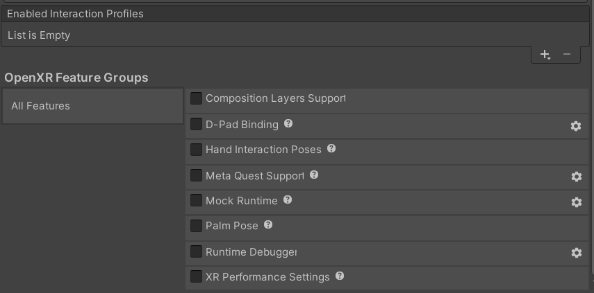

# OpenXR features

OpenXR is an extensible API that can be extended with new features. To facilitate this within the Unity ecosystem, the Unity OpenXR provider supports a feature extension mechanism.

## Feature management

You can manage features from the **Project Settings &gt; XR Plug-in Management &gt; OpenXR** window.

To enable or disable a feature, select or clear the checkbox next to it. Unity doesn't execute disabled features at runtime, and doesn't deploy any of the feature's native libraries with the Player build. To configure additional build-time properties specific to each feature, click the gear icon to the right of the feature.

The list of features is populated from the provider plug-ins and related XR packages installed in your project.

**Feature Groups** groups related **features** together. For example, a OpenXR provider plug-in might provide a number of features and place them in the same Feature Group to make them easier to find. Depending on the how the package providing the features is configured, checking the box for a Feature Group can enable all or just some of the features in the group. You can also enable or disable optional features individually.
