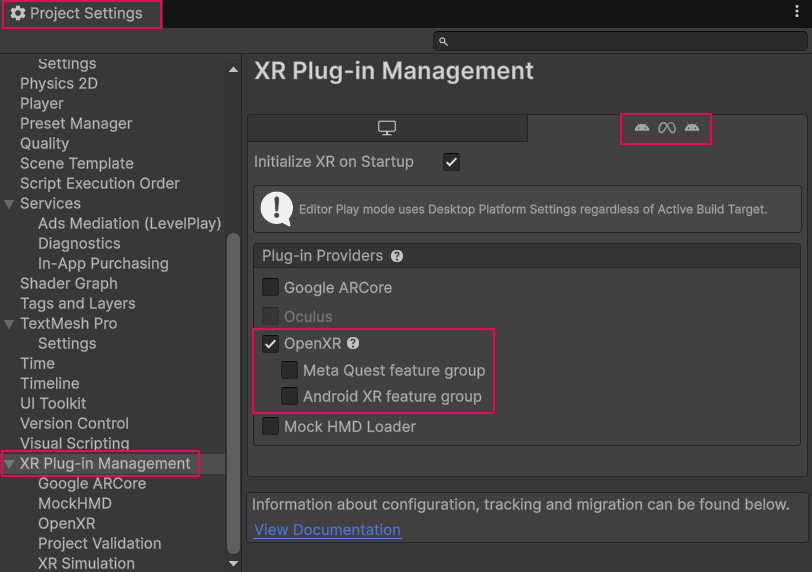
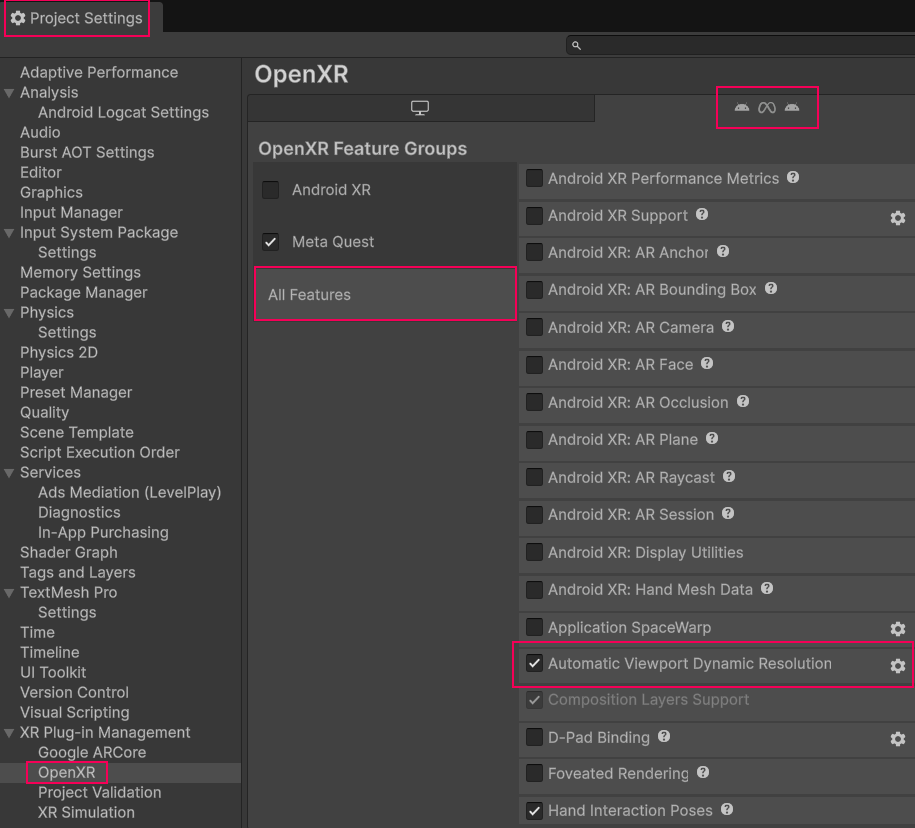
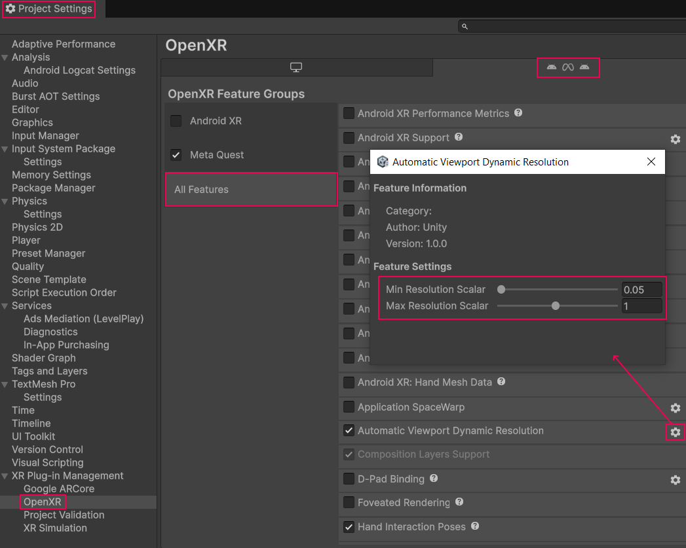
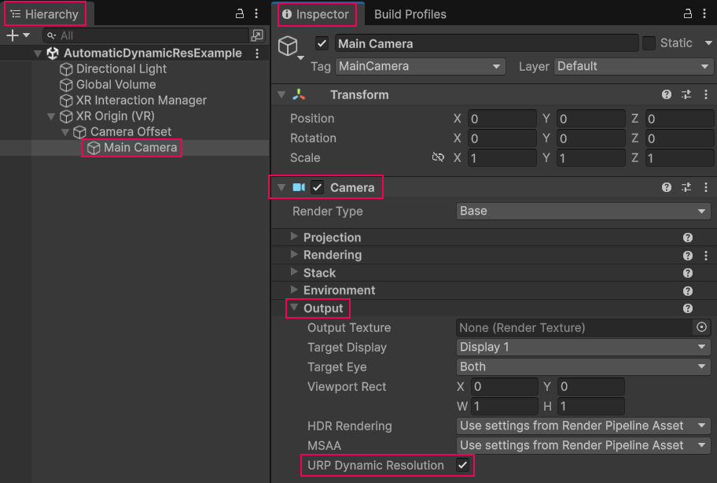

# Automatic viewport dynamic resolution

Understand the OpenXR automatic viewport dynamic resolution feature.

Automatic viewport dynamic resolution is a feature that controls the resolution of your XR project, and keeps it within a specified range. On supported platforms, enabling automatic viewport dynamic resolution can maintain a stable frame rate and improve graphical performance.

This page outlines the automatic viewport dynamic resolution feature and how to use it in your Unity project.

## Prerequisites

To use automatic viewport dynamic resolution, your project must meet the following requirements:

* Unity 6.3 or newer
* OpenXR 1.16.0 or newer
* Universal Render Pipeline (URP) 17.0.3 or newer
* Vulkan graphics API
* An OpenXR provider plug-in ([Unity OpenXR Meta](https://docs.unity3d.com/Packages/com.unity.xr.meta-openxr@latest) or [Unity OpenXR Android XR](https://docs.unity3d.com/Packages/com.unity.xr.androidxr-openxr@latest))

### Compatible devices

Automatic viewport dynamic resolution is supported on XR devices that support either the Khronos OpenXR [XR_META_recommended_layer_resolution](https://registry.khronos.org/OpenXR/specs/1.0/html/xrspec.html#XR_META_recommended_layer_resolution) extension or the Khronos OpenXR `XR_ANDROID_recommended_resolution` extension.

The following devices support automatic viewport dynamic resolution:

* Android XR
* Meta Quest 2
* Meta Quest 3

## Feature compatibility

Not all features are compatible with automatic viewport dynamic resolution. Refer to the following list to understand the features that aren't compatible with automatic viewport dynamic resolution:

* Automatic viewport dynamic resolution isn't supported in the [URP compatibility mode](xref:urp-compatibility-mode)
* If your project uses [Multiview Render Regions](xref:openxr-multiview-render-regions) and dynamic resolution together, Unity recommends that you enable [Final Pass Mode](xref:openxr-multiview-render-regions#reference). Avoid **All Passes** mode if your project uses dynamic resolution.

## Enable automatic viewport dynamic resolution

To enable automatic viewport dynamic resolution in your project:

1. Open the **XR Plug-in Management** section in project settings (menu: **Edit** > **Project Settings** > **XR Plug-in Management**).
2. Select your XR device platform's corresponding tab at the top of the page, enable OpenXR, then enable the feature group that appears corresponding to your XR device platform.

    *Select your OpenXR feature group*

3. Open the **OpenXR** section of **XR Plug-in Management** (menu: **Edit** > **Project Settings** > **XR Plug-in Management** > **OpenXR**).
4. Select your XR device platform's corresponding tab at the top of the page, then under **OpenXR Feature Groups**, select the **All Features** tab.
5. Enable **Automatic Viewport Dynamic Resolution**.

    *Enable the automatic viewport dynamic resolution feature*

6. When you have enabled **Automatic Viewport Dynamic Resolution**, you can use the corresponding **Gear** icon to open [automatic viewport dynamic resolution settings](#settings).

## Automatic viewport dynamic resolution settings

You can use the corresponding **Gear** icon to open the **Automatic Viewport Dynamic Resolution** settings window and configure the following settings:

| **Setting** | **Description** |
| :---------- | :-------------- |
| **Min Resolution Scalar** | Set the minimum resolution scalar.  **Note**: The actual minimum resolution scalar that the Unity Engine can render is currently `0.5`. The minimum resolution scalar will change in a future version of Unity. You can set this slider to less than `0.5`, but it currently won't have any effect below `0.5`. |
| **Max Resolution Scalar** | Set the maximum resolution scalar. |

 *Automatic dynamic resolution settings window.*

## Enable URP dynamic resolution

Unity recommends that you enable the URP dynamic resolution feature for optimal performance. To enable URP dynamic resolution:

1. Open your Main Camera in the **Inspector** window.
2. Under **Output**, enable **URP Dynamic Resolution**.

    *Enable URP dynamic resolution*

## Control automatic viewport dynamic resolution at runtime

You can set the resolution at runtime to disregard the suggested resolution and stop automatic viewport dynamic resolution from automatically updating the resolution.

To manually set the resolution at runtime:

1. Ensure that the device supports automatic viewport dynamic resolution using the `AutomaticDynamicResolutionFeature.IsAutomaticDynamicResolutionScalingSupported()` function.
2. Define whether you want to let the feature automatically update resolution using the `AutomaticDynamicResolutionFeature.SetUsingSuggestedResolutionScale(bool)` function.

When you use these functions to manually set the resolution at runtime, automatic viewport dynamic resolution remains enabled. You can use these functions to re-enable automatic resolution updates.

To check whether automatic viewport dynamic resolution is currently allowing automatic resolution updates, use the  `AutomaticDynamicResolutionFeature.usingSuggestedResolutionScale` property. This property is read-only outside the `AutomaticDynamicResolutionFeature` class.

## Additional resources

* [Rendergraph](xref:urp-render-graph)
* [Using the Universal Render Pipeline](xref:um-universal-render-pipeline)
* [Shader Graph](xref:um-shader-graph)
* [Resolution control in XR projects](xref:um-xr-graphics-resolution-scaling)
