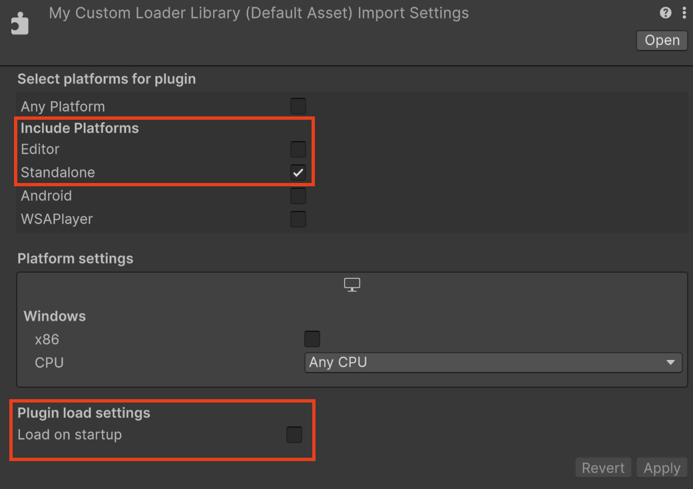

# Integrate OpenXR features

OpenXR is an extensible API that you can extend with new features. To facilitate this within the Unity ecosystem, the Unity OpenXR provider supports a feature extension mechanism.

> [!IMPORTANT]
> This section of the OpenXR package documentation is for developers integrating the OpenXR features provided by an XR device. If you are developing an XR application, refer to [Feature Management](xref:openxr-features) for information about how to enable features provided by the XR packages you have installed in your project. App developers typically don't create features or feature groups.

## Define a feature

Unity OpenXR features are defined and executed in C#. C# can call to a custom native plug-in if desired. The feature can live somewhere in the user's project or in a package, and it can include any Assets that a normal Unity project would use.

A feature must override the `OpenXRFeature` ScriptableObject class. There are several methods that you can override on the `OpenXRFeature` class in order to do things like intercepting native OpenXR calls, obtaining the `xrInstance` and `xrSession` handles, starting Unity subsystems, etc.

A feature can add public fields for user configuration at build time. Unity renders these fields via a `PropertyDrawer` in the feature UI, and you can override them. Your feature can access any of the set values at runtime.

A feature must also provide an `OpenXRFeature` attribute when running in the Editor.

[!code-csharp[InterceptCreateSessionFeatureExample](../../../com.unity.xr.openxr/Tests/Editor/CodeSamples/InterceptCreateSessionFeatureExample.cs#InterceptCreateSessionFeatureExample)]

Unity uses this information at build time, either to build the Player or to display it to the user in the UI.

## Defining a feature group

Unity OpenXR allows you to define a feature group you can use to organize a group of features.

Declare a feature group through the definition of one or more `OpenXRFeatureSetAttribute` declarations in your code. You can place the attribute anywhere because the feature group functionality only depends on the attribute existing and not on the actual class it's declared on.

[!code-csharp[FeatureSetDefinitionExample](../../../com.unity.xr.openxr/Tests/Editor/CodeSamples/FeatureSetDefinitionExample.cs#FeatureSetDefinitionExample)]

### Enabling OpenXR spec extension strings

Unity attempts to enable any extension strings listed in `OpenXRFeatureAttribute.OpenxrExtensionStrings` (separated via spaces) on startup. Your feature can check the enabled extensions to determine if the requested extension was enabled (via `OpenXRRuntime.IsExtensionEnabled`).

[!code-csharp[OnInstanceCreateExtensionCheckExample](../../../com.unity.xr.openxr/Tests/Editor/CodeSamples/OnInstanceCreateExtensionCheckExample.cs#OnInstanceCreateExtensionCheckExample)]

### OpenXRFeature call order

The `OpenXRFeature` class has a number of methods that your method can override. Implement overrides to get called at specific points in the OpenXR application lifecycle.

#### Bootstrapping

`HookGetInstanceProcAddr`

This is the first callback invoked, giving your feature the ability to hook native OpenXR functions.

#### Initialize

`OnInstanceCreate => OnSystemChange => OnSubsystemCreate => OnSessionCreate`

The initialize sequence allows features to initialize Unity subsystems in the Loader callbacks and execute them when specific OpenXR resources are created or queried.

#### Start

`OnFormFactorChange => OnEnvironmentBlendModeChange => OnViewConfigurationTypeChange => OnSessionBegin =>  OnAppSpaceChange => OnSubsystemStart`

The Start sequence allows features to start Unity subsystems in the Loader callbacks and execute them when the session is created.

#### Game loop

Several: `OnSessionStateChange`

`OnSessionBegin`

Maybe: `OnSessionEnd`

Callbacks during the game loop can react to session state changes.

#### Stop

`OnSubsystemStop => OnSessionEnd`

#### Shut down

`OnSessionExiting => OnSubsystemDestroy => OnAppSpaceChange => OnSessionDestroy => OnInstanceDestroy`

### Build Time Processing

A feature can inject some logic into the Unity build process in order to do things like modify the manifest.

Typically, you can do this by implementing the following interfaces:

* `IPreprocessBuildWithReport`
* `IPostprocessBuildWithReport`
* `IPostGenerateGradleAndroidProject`

Features **should not** implement these classes, but should instead implement `OpenXRFeatureBuildHooks`, which only provide callbacks when the feature is enabled. For more information, refer to the [OpenXRFeatureBuildHooks](xref:UnityEditor.XR.OpenXR.Features.OpenXRFeatureBuildHooks) class.

### Build time validation

If your feature has project setup requirements or suggestions that require user acceptance, implement `GetValidationChecks`.  Features can add to a list of validation rules which Unity evaluates at build time. If any validation rule fails, Unity displays a dialog asking you to fix the error before proceeding. Unity can also presents warning through the same mechanism. It's important to note which build target the rules apply to.

Example:

[!code-csharp[BuildTimeValidationExample](../../../com.unity.xr.openxr/Tests/Editor/CodeSamples/BuildTimeValidationExample.cs#BuildTimeValidationExample)]


### Custom Loader library

The Unity OpenXR package always ships with the latest Khronos OpenXR loader library at the time the package is released. In some cases, your OpenXR feature might require a more recent version of the standard loader library or a custom loader library. To facilitate this, you can include a loader library in your package and specify the appropriate values for your feature's [OpenXRFeatureAttribute](xref:UnityEditor.XR.OpenXR.Features.OpenXRFeatureAttribute) properties.

Use `openxr_loader` as the base file name your custom loader library. Modify this base name according to the native library naming conventions for each platform build target (for example, use`libopenxr_loader.so` on Android). Place the library in the same directory or a subdirectory relative to the C# script that extends the [OpenXRFeature](xref:UnityEngine.XR.OpenXR.Features.OpenXRFeature) class to define your feature. When the feature is enabled in a Unity project, Unity evaluates whether to include your custom loader library in an application build instead of the default loader library.

To use a custom loader library for a feature, set the following [OpenXRFeature](xref:UnityEngine.XR.OpenXR.Features.OpenXRFeature) properties:

| Property | Value |
| :------- | :---- |
| [CustomRuntimeLoaderBuildTargets](xref:UnityEditor.XR.OpenXR.Features.OpenXRFeatureAttribute.CustomRuntimeLoaderBuildTargets) | Assign a list of BuildTargets for which your custom loader library should be used. If your feature doesn't use a custom loader library, you don't need to assign a value to `CustomRuntimeLoaderBuildTargets` (you can also set it to null or an empty list). |
| [CustomRuntimeLoaderVersion](xref:UnityEditor.XR.OpenXR.Features.OpenXRFeatureAttribute.CustomRuntimeLoaderVersion) | Set the version of the Khronos OpenXR API that the custom loader supports. If you don't specify an OpenXR API version, then Unity always uses your custom loader when this feature is enabled, unless another enabled feature also specifies a custom loader without declaring an OpenXR API version. Refer to [Loader library selection](#loader-library-selection) for information about how such conflicts are resolved. |
| [TargetOpenXRApiVersion](xref:UnityEditor.XR.OpenXR.Features.OpenXRFeatureAttribute.TargetOpenXRApiVersion) | Set the version of the Khronos OpenXR API that the application should target when it deploys. This is distinct from `CustomRuntimeLoaderVersion`, and is only used for determining the version of the OpenXR API that is used at runtime, and has no bearing on the OpenXR loader library which is included. |
| [CustomRuntimeLoaderName](xref:UnityEditor.XR.OpenXR.Features.OpenXRFeatureAttribute.CustomRuntimeLoaderName) | Set the name used by your feature's custom loader. If your feature doesn't specify a value to `CustomRuntimeLoaderBuildTargets`, this property is ignored. If no name is specified, it is assumed the library name will be `openxr_loader` Refer to [Customized name for a custom loader library](#custom-runtime-loader-name) for information about the expected set up for loaders with a custom name. |

> [!NOTE]
> If your custom loader library requires the same OpenXR API version as the default Khronos loader in this Unity OpenXR package, the build uses the default loader instead of your custom one.

#### Loader library selection {#loader-library-selection}

The Unity build always uses the default loader library from the Unity OpenXR package, unless an enabled feature declares a custom loader library with a higher [CustomRuntimeLoaderVersion](xref:UnityEditor.XR.OpenXR.Features.OpenXRFeatureAttribute.CustomRuntimeLoaderVersion) than the API version supported by the loader included in the Unity package. This resolution method lets your feature use a newer loader library at the time you publish your feature, while letting an update of the Unity OpenXR package supersede it in a future release.

If two enabled features declare custom loader libraries and the same `CustomRuntimeLoaderVersion` value, then the loader for the feature with the highest [Priority](xref:UnityEditor.XR.OpenXR.Features.OpenXRFeatureAttribute.Priority) is used.

 For backward compatibility, the loader library for a feature that doesn't specify a value for [CustomRuntimeLoaderVersion](xref:UnityEditor.XR.OpenXR.Features.OpenXRFeatureAttribute.CustomRuntimeLoaderVersion), overrides any other loaders, including the default loader from the Unity OpenXR package.

> [!IMPORTANT]
> You should always specify a value for [CustomRuntimeLoaderVersion](xref:UnityEditor.XR.OpenXR.Features.OpenXRFeatureAttribute.CustomRuntimeLoaderVersion). If an application developer enables more than one feature that declares a custom loader library for a BuildTarget without also specifying an OpenXR API version in the `CustomRuntimeLoaderVersion` field, then their builds will fail.

#### Customized name for a custom loader library {#custom-runtime-loader-name}

You can use a customized file name for the custom OpenXR loader that your feature provides. When you use a custom library name for your loader, you avoid possible name conflicts with other packages that provide custom OpenXR loader libraries.

> [!NOTE]
> Name conflicts between custom OpenXR loader libraries can occur in the Unity Editor when your plug-in supports the Editor or Standalone platforms. You can avoid the possibility of conflicts by using a unique name for your loader library and specifying the name in your [OpenXRFeatureSet](xref:UnityEditor.XR.OpenXR.Features.OpenXRFeatureSetAttribute) declaration.

To use a customized name, set the [CustomRuntimeLoaderName](xref:UnityEditor.XR.OpenXR.Features.OpenXRFeatureAttribute.CustomRuntimeLoaderName) property of the corresponding [OpenXRFeature attribute](xref:UnityEditor.XR.OpenXR.Features.OpenXRFeatureSetAttribute) declaration to the library name.

``` csharp
using UnityEditor;
using UnityEngine.XR.OpenXR.Features;

namespace UnityEngine.XR.OpenXR.CodeSamples.Editor.Tests
{
    [UnityEditor.XR.OpenXR.Features.OpenXRFeature(
        FeatureId = "com.unity.openxr.features.customNameForLoaderExample",
        UiName = "Feature with customized name for custom loader",
        CustomRuntimeLoaderBuildTargets = new[] { BuildTarget.StandaloneWindows64 },
        CustomRuntimeLoaderName = "MyCustomLoaderLibrary"
        )]
    public class CustomNameForLoaderExample : OpenXRFeature
    {
    }
}
```

If you intend to use your custom OpenXR loader library for the Editor or Standalone platforms, use the following [import settings](xref:um-plugin-inspector) for your custom library:
* Under **Include Platforms**, the **Editor** option is off, and the **Standalone** option is on.
* Under **Plugin load settings**, the **Load on startup** option is off.



> [!NOTE]
> The Unity OpenXR SDK loads your custom loader with a customized name when starting Play mode in the Editor, even if your custom loader import settings has the Editor platform as toggled off, because the custom loader plugin is loaded by the Unity OpenXR SDK native plugin instead of the Unity engine itself. Note also that the [Loader library selection](#loader-library-selection) rules still apply, so your custom loader library may not be loaded if another one can override it by version or priority.

There are some limitations on the name that can be used:
* The custom loader name cannot be `openxr_loader`. Using this name can cause conflicts with the existing default loader, or other features' custom loader that doesn't use a customized name.
* The customized name for your custom loader shouldn't include the extension. The extension is defined at runtime, depending on the platform where your app is running. Adding the extension may interfere with this mechanism.
* The name cannot be customized per build target. All custom loaders provided by your feature need to use the same name.

> [!IMPORTANT]
> In Android, the custom loader name applies only to the Android Archive (AAR) file that contains the Shared Object (SO) file that is OpenXR loader library. The name of the loader's SO file inside the AAR file must contain `openxr_loader` to be loaded at runtime.

### Feature native libraries

Any native libraries included in the same directory or a subdirectory of your feature will only be included in the built Player if your feature is enabled.

## Feature use cases

### Intercepting OpenXR function calls

To intercept OpenXR function calls, override `OpenXRFeature.HookGetInstanceProcAddr`. Returning a different function pointer allows intercepting any OpenXR method. For an example, see the `Intercept Feature` sample.

### Calling OpenXR functions from a feature

To call an OpenXR function within a feature you first need to retrieve a pointer to the function. To do this use the `OpenXRFeature.xrGetInstanceProcAddr` function pointer to request a pointer to the function you want to call. Using  `OpenXRFeature.xrGetInstanceProcAddr` to retrieve the function pointer ensures that any intercepted calls set up by features using `OpenXRFeature.HookGetInstanceProcAddr` will be included.

### Providing a Unity subsystem implementation

`OpenXRFeature` provides several XR Loader callbacks where you can manage the lifecycle of Unity subsystems. For an example meshing subsystem feature, see the `Meshing Subsystem Feature` sample.

Note that a `UnitySubsystemsManifest.json` file is required in order for Unity to discover any subsystems you define. At the moment, there are several restrictions around this file:

* It must be only 1 subfolder deep in the project or package.
* The native library it refers to must be only 1-2 subfolders deeper than the `UnitySubsystemsManfiest.json` file.
