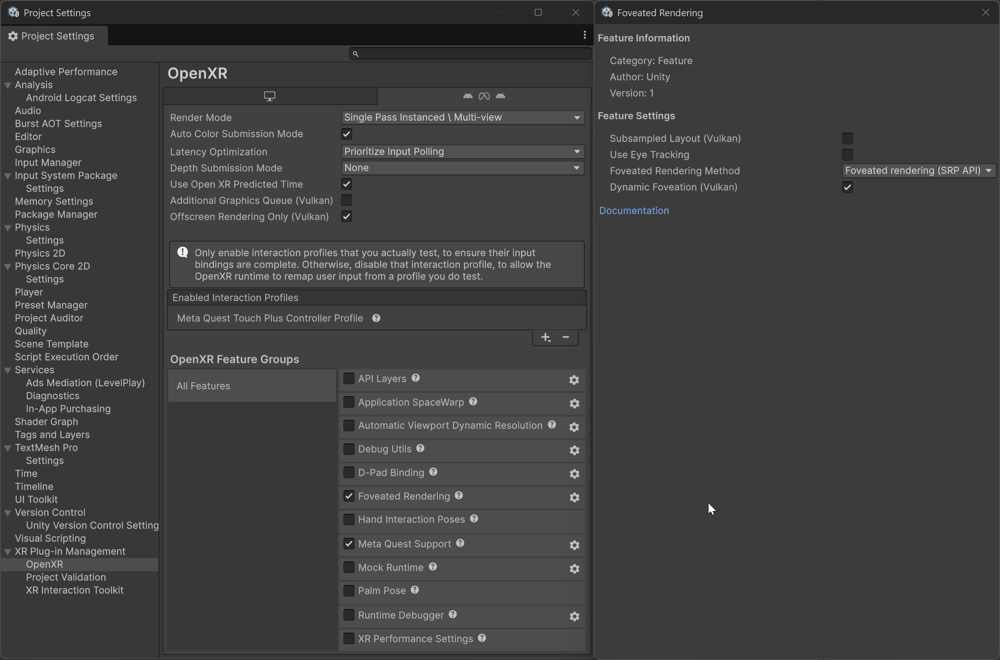

# Use dynamic foveation

Let a supporting device vary the amount of foveation it applies, up to the foveation level you set.

With dynamic foveation, a supporting XR device varies the amount of foveation it applies while your application runs. This behavior can improve performance when your application presents a scene that contains a large amount of content.

Dynamic foveation doesn't set the amount of foveation itself. You control the amount with the foveation level, which you set through the scriptable render pipeline (SRP) foveation API. Assign the level to [`XRDisplaySubsystem.foveatedRenderingLevel`](xref:UnityEngine.XR.XRDisplaySubsystem.foveatedRenderingLevel), as described in [Use the SRP foveation API](xref:openxr-foveated-rendering-srp-api). When you disable dynamic foveation, the device applies that level constantly. When you enable dynamic foveation, the level becomes a maximum. The device applies less foveation when the GPU has available capacity, and increases foveation up to the level you set when GPU load rises. The runtime determines this behavior, so the exact conditions vary by device.

> [!IMPORTANT]
> Because the foveation level acts as a maximum, dynamic foveation has no effect while the foveation level is `0`, which is the default. Set a foveation level greater than `0` for dynamic foveation to have an effect.

Dynamic foveation is independent of [gaze-based foveated rendering](xref:openxr-foveated-rendering-gaze-based). **Use Eye Tracking** doesn't enable dynamic foveation, so enable each one separately. You can use both at the same time. The amount of foveation then adjusts to the current GPU load while the high-resolution area follows the user's gaze.

## Prerequisites

Ensure your project meets the requirements outlined in [Dynamic foveation requirements](xref:openxr-foveated-rendering-requirements#dynamic-foveation-requirements).

Configure the SRP foveation method before you begin, as described in [Use the SRP foveation API](xref:openxr-foveated-rendering-srp-api).

## Enable dynamic foveation

To enable dynamic foveation in your Unity project:

1. Open the **Project Settings** window.
1. Under **XR Plug-in Management**, select the **OpenXR** settings.
1. Select the tab for the platform you want to configure.
1. In the list of **OpenXR Feature Groups**, select **All Features**.
1. Under **OpenXR Feature Groups**, enable the **Foveated Rendering** feature.
1. Under **OpenXR Feature Groups**, select the gear icon next to the **Foveated Rendering** feature.
1. Enable the **Dynamic Foveation (Vulkan)** setting.

 *Dynamic foveation settings.*

Unity applies this setting when the OpenXR session starts. You can also enable or disable dynamic foveation at runtime with [`FoveatedRenderingFeature.DynamicFoveationEnabled`](xref:UnityEngine.XR.OpenXR.Features.FoveatedRenderingFeature.DynamicFoveationEnabled), which overrides the project setting for the rest of the session.

The following code example sets a foveation level and then enables dynamic foveation, so that the device can vary the amount of foveation it applies up to that level:

[!code-csharp[DynamicFoveationExample](../../../../com.unity.xr.openxr/Tests/Editor/CodeSamples/DynamicFoveationExample.cs#DynamicFoveationExample)]

## Additional resources

* [Foveated rendering requirements reference](xref:openxr-foveated-rendering-requirements)
* [Use the SRP foveation API](xref:openxr-foveated-rendering-srp-api)
* [Configure gaze-based foveated rendering](xref:openxr-foveated-rendering-gaze-based)
* [OpenXR settings reference](xref:openxr-settings)
