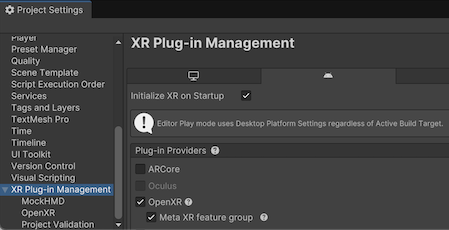
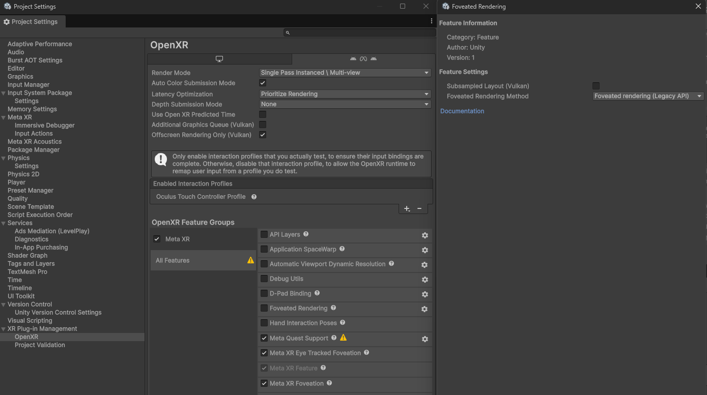

# Use the legacy foveation API

Configure the legacy foveation method with the Meta XR Core SDK, then set the foveation level at runtime.

The legacy API supports Meta Quest headsets only, and might not work on other devices. Use it when your project targets the Built-In Render Pipeline, which the scriptable render pipeline (SRP) foveation API doesn't support.

> [!NOTE]
> The Meta XR Core SDK is a third-party package that Unity doesn't control. The OpenXR features and API it provides can change without notice.

## Prerequisites

Before you begin, make sure your project meets the conditions in [Foveated rendering requirements reference](xref:openxr-foveated-rendering-requirements).

Install the [Meta XR Core SDK](com.unity3d.kharma:upmpackage/com.meta.xr.sdk.core) package, if you haven't already. You can get this package from the [Unity Asset Store](https://assetstore.unity.com/packages/tools/integration/meta-xr-core-sdk-269169). The package adds the **Meta XR** feature group and its associated features to the OpenXR settings. Refer to the [Meta Horizon](https://developer.oculus.com/downloads/package/meta-xr-core-sdk/68.0) developer documentation for more information.

## Configure the legacy foveation method

Set the **Foveated Rendering Method** option to **Foveated rendering (Legacy API)**, and enable the **Meta XR Foveation** feature.

To configure foveated rendering with the legacy API:

1. Open the **Project Settings** window.
1. Select the **XR Plug-in Management** settings.
1. Select the **Android** tab.
1. Under **OpenXR**, enable the **Meta XR** feature group. Unity might prompt you to restart the Unity Editor. Restart now, or after you finish configuring these settings.

   

1. Under **XR Plug-in Management**, select the **OpenXR** settings.
1. Set the **Foveated Rendering Method** option to **Foveated rendering (Legacy API)**.
1. In the list of **OpenXR Feature Groups**, select **All Features**.
1. Disable the **Foveated Rendering** feature, if you enabled it.
1. Enable the **Meta XR Foveation** feature.
1. (Optional) Enable the **Meta XR Eye Tracked Foveation** feature.

<br/>*Legacy API foveated rendering settings.*

After you apply these settings, the legacy API is available in your project. Next, set the foveation level at runtime.

## Set the foveation level

The following code example sets foveated rendering to `High` and enables gaze-based foveation with the legacy API and the Meta XR Core SDK package:

```csharp
using UnityEngine;
using UnityEngine.XR;

public class FoveationStarter : MonoBehaviour
{
    private void Start()
    {
        // Only use with the Meta XR Core SDK.
        OVRManager.foveatedRenderingLevel = OVRManager.FoveatedRenderingLevel.High;
        OVRManager.eyeTrackedFoveatedRenderingEnabled = true;
    }
}
```

Refer to Meta's [OVRManager Class Reference](https://developer.oculus.com/reference/unity/v67/class_o_v_r_manager#acbd6d504192d2a2a7461382a4eae0715a84ec48f67b50df5ba7f823879769e0ad) for more information.

## Additional resources

* [Foveated rendering requirements reference](xref:openxr-foveated-rendering-requirements)
* [Use the SRP foveation API](xref:openxr-foveated-rendering-srp-api)
* [Configure gaze-based foveated rendering](xref:openxr-foveated-rendering-gaze-based)
* [Introduction to foveated rendering in OpenXR](xref:openxr-foveated-rendering-introduction)
