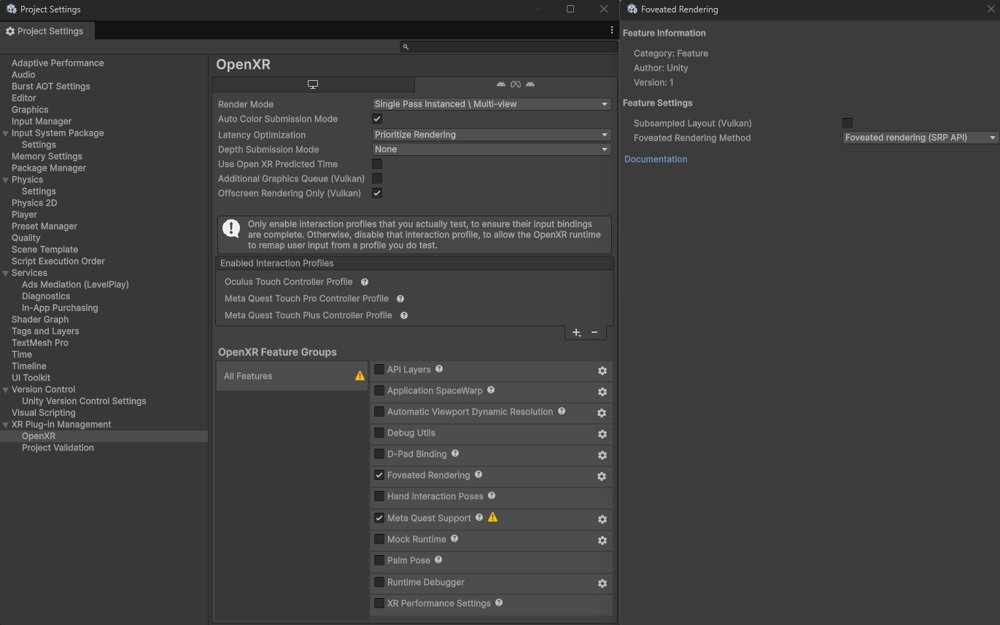

# Use the SRP foveation API

Configure the scriptable render pipeline (SRP) foveation method in the OpenXR settings, then set the foveation level at runtime.

The SRP foveation API works on every platform that supports foveated rendering, so you can share code across device types. Configuring the setting on its own has no effect: you must also set the foveation level at runtime, because Unity sets that level to `0` by default.

## Prerequisites

Before you begin, make sure your project meets the conditions in [Foveated rendering requirements reference](xref:openxr-foveated-rendering-requirements).

## Configure the SRP foveation method

To configure foveated rendering with the SRP foveation API in Unity 6 or later:

1. Open the **Project Settings** window.
1. Under **XR Plug-in Management**, select the **OpenXR** settings.
1. Select the tab for the platform you want to configure.
1. In the list of **OpenXR Feature Groups**, select **All Features**.
1. Under **OpenXR Feature Groups**, enable the **Foveated Rendering** feature.
1. Under **OpenXR Feature Groups**, select the gear icon next to the **Foveated Rendering** feature.
1. Set the **Foveated Rendering Method** option to the SRP foveation option. Unity names this option **Foveated rendering (SRP API)** on Android, and **SRP Foveation** on other platforms.

 *SRP foveation API settings.*

After you apply these settings, the SRP foveation API is available in your project. Next, set the foveation level at runtime.

## Set the foveation level

To specify the amount of the foveation effect, assign a value between `0` and `1` to the [`XRDisplaySubsystem.foveatedRenderingLevel`](xref:UnityEngine.XR.XRDisplaySubsystem.foveatedRenderingLevel) property. The default value of `0` disables foveation, and `1` is the maximum level. Different device types can interpret this value in the way that best suits their platform-specific APIs.

Meta Quest devices, for example, have discrete foveation levels. If you assign `0.5` to `foveatedRenderingLevel`, the provider plug-in sets the device's `Medium` level.

To use gaze-based foveated rendering, set [`XRDisplaySubsystem.foveatedRenderingFlags`](xref:UnityEngine.XR.XRDisplaySubsystem.foveatedRenderingFlags) to [`FoveatedRenderingFlags.GazeAllowed`](xref:UnityEngine.XR.XRDisplaySubsystem.FoveatedRenderingFlags.GazeAllowed).

The device uses fixed foveated rendering in any of the following cases:

* You don't set this flag.
* The device doesn't support gaze-based foveated rendering.
* The user denies or revokes eye-tracking permission.

To set either of these properties, you must first get a reference to the active [`XRDisplaySubsystem`](xref:UnityEngine.XR.XRDisplaySubsystem) from the Unity [`SubsystemManager`](xref:UnityEngine.SubsystemManager). Unity supports multiple subsystems of the same type, and returns a list when you get the subsystems of a given type. Ordinarily, only one `XRDisplaySubsystem` exists. Use the single entry in the list that [`SubsystemManager.GetSubsystems`](xref:UnityEngine.SubsystemManager.GetSubsystems(System.Collections.Generic.List`1<T>)) returns.

The following code example sets foveated rendering to the maximum level and enables gaze-based foveation, after getting the instance of the active `XRDisplaySubsystem`:

[!code-csharp[FoveationSrpApiExample](../../../../com.unity.xr.openxr/Tests/Editor/CodeSamples/FoveationSrpApiExample.cs#FoveationSrpApiExample)]

> [!NOTE]
> This code example relies on methods available in Unity 6 or later. It doesn't compile in earlier versions.

## Additional resources

* [Foveated rendering requirements reference](xref:openxr-foveated-rendering-requirements)
* [Configure gaze-based foveated rendering](xref:openxr-foveated-rendering-gaze-based)
* [Use dynamic foveation](xref:openxr-foveated-rendering-dynamic)
* [Use the legacy foveation API](xref:openxr-foveated-rendering-legacy-api)
