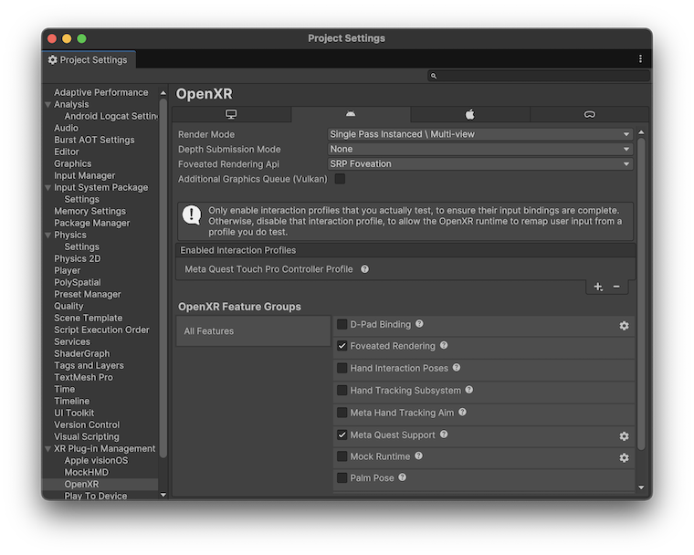
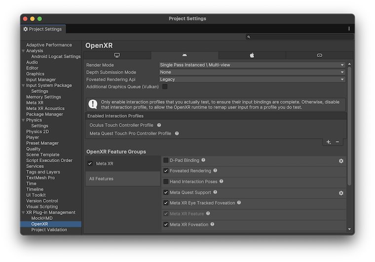

# Foveated rendering in OpenXR

Foveated rendering is an optimization technique that can speed up rendering with little perceived impact on visual quality. Foveated rendering works by lowering the resolution of areas in the user's peripheral vision. On headsets that support eye-tracking as well as foveated rendering, the higher-resolution area can be centered where the user is currently looking. Without eye-tracking, the higher resolution area is fixed near the middle of the screen. Fixed foveated rendering can be more apparent to the user since they can shift their eyes to look at the peripheral areas.

OpenXR platforms use the variable shading rate (VSR) technique for foveated rendering, which does not require you to change custom shaders. (However, if you are creating assets that should work on all XR platforms, refer to the "Foveated rendering shaders" topic in [Foveated rendering](https://docs.unity3d.com/Manual/xr-foveated-rendering.html) to learn how to write shaders and shader graphs that work under all supported foveated rendering methods.)

OpenXR devices can implement VRS using a variety of techniques and a single device can support more than one implementation. The Unity OpenXR plug-in chooses from the following techniques, in this order, depending on what the current device supports:

1. Gaze-based Fragment Density Map (GFDM) from provider.
2. Fixed Fragment Density Map (FFDM) from provider.
3. Fragment Shading Rate (FSR) using a provider's texture.
4. Fragment Shading Rate using a compute shader calculated from the asymmetric FOVs the provider gives.

This topic covers aspects of foveated rendering specific to the Unity OpenXR provider plug-in:

* [Prerequisites](#prerequisites)
* [Configure foveated rendering](#configure-foveated-rendering)
* [Use the **SRP Foveation** API](#use-the-srp-foveation-api)
* [Use the **Legacy** API](#use-the-legacy-api)
* [Request eye-tracking permission on Android](#request-eye-tracking-permission)

For general information about foveated rendering in Unity XR, refer to [Foveated rendering](https://docs.unity3d.com/Manual/xr-foveated-rendering.html).

<a id="prerequisites"></a>
## Prerequisites

To use the foveated rendering feature in OpenXR, your project must meet the following prerequisites:

* Unity 6+
* Unity OpenXR plugin (com.unity.xr.openxr) 1.11.0+
* Universal Rendering Pipeline or High Definition Render Pipeline (HDRP not recommended for mobile XR platforms such as the Meta Quest family of devices)

Alternately, you can use the Meta Core XR SDK package to access the OpenXR foveated rendering feature on Quest devices:

* Unity 2022.2+, Unity 6+
* Unity OpenXR plugin (com.unity.xr.openxr) 1.11.0+
* Meta Core XR SDK 68.0+
* Built-in or Universal Rendering Pipeline

> [!NOTE]
> The primary differences between the Unity **SRP Foveation** API and the Meta API for foveated rendering include:
>
> * They uses different APIs and code paths to enable and control foveated rendering on a device.
> * The Unity **SRP Foveation** API works on all platforms that support foveated rendering, which allows you to share code across different types of devices.
> * The Unity **SRP Foveation** API does not support the Built-in Rendering Pipeline.
> * The Meta API, which only works on Quest devices, supports Unity 2022.3 and the Built-in Render Pipeline.
> * The Meta API does not support foveated rendering when you use intermediate render targets. Intermediate rendering targets are used by post-processing, tone mapping and camera stacking, for example, and may be used by other rendering features, too.
>
> Unity recommends that you use the Unity **SRP Foveation** API where possible for better compatibility. You can still use other features from the Meta Core XR SDK in conjunction with the **SRP Foveation** API, if desired.

<a id="configure-foveated-rendering"></a>
## Configure foveated rendering

You can configure foveated rendering in a project that meets the [Prerequisites](#prerequisites):

* [Configure SRP Foveation](#configure-srp-foveation)
* [Configure Legacy foveated rendering](#configure-legacy-foveated-rendering)
* [Configure gaze-based foveated rendering](#configure-gaze-based-foveated-rendering)

Once configured in settings, you must also turn on foveated rendering at runtime. By default, the foveated rendering strength or level is set to off. You must also set a runtime flag to use gaze-based foveated rendering.

Refer to the following topics for more information:

* [Use the SRP Foveation API](#use-the-srp-foveation-api)
* [Use the Legacy API](#use-the-srp-foveation-api)

<a id="configure-srp-foveation"></a>
### Configure SRP Foveation

To enable the **SRP Foveation** API in Unity 6+:

1. Open the **Project Settings** window.
2. Under **XR Plug-in Management**, select the **OpenXR** settings.
3. Set the **Foveated Rendering API** option to **SRP Foveation**.
3. In the list of **OpenXR Feature Groups**, select **All Features**.
4. Enable the **Foveated Rendering** feature.

<br/>*Settings to enable foveated rendering with the **SRP Foveation** API*

After you have configured the settings, you must also turn on foveated rendering at runtime. Refer to [Use the SRP Foveation API](#use-the-srp-foveation-api) for more information.

> [!NOTE]
> You must configure the project to use either the [Universal Render Pipeline (URP)](https://docs.unity3d.com/Packages/com.unity.render-pipelines.universal@17.0/manual/InstallURPIntoAProject.html) or the [High Definition Render Pipeline (HDRP)](https://docs.unity3d.com/Packages/com.unity.render-pipelines.high-definition@17.0/manual/convert-project-from-built-in-render-pipeline.html), if you have not already done so.

<a id="configure-legacy-foveated-rendering"></a>
### Configure Legacy foveated rendering

In Unity 6+, set the OpenXR **Foveated Render API** option to **Legacy** to use the Meta Core XR SDK, which only supports the Meta Quest family of devices. In Unity 2022, there is no option to select a **Foveated Rendering API**. Only the legacy API using the Meta Core XR SDK is supported.

1. Install the [Meta Core XR SDK](com.unity3d.kharma:upmpackage/com.meta.xr.sdk.core) package, if necessary. You can get this package from the [Unity Asset Store](https://assetstore.unity.com/packages/tools/integration/meta-xr-core-sdk-269169). The package adds the Meta OpenXR feature group to the OpenXR along with the associated features. Refer to the [Meta Developer site](https://developer.oculus.com/downloads/package/meta-xr-core-sdk/68.0) for more information.
2. Open the **Project Settings** window.
3. Select the **XR Plug-in Management** settings from the list on the left.
4. Select the **Android** tab.
5. Under **OpenXR**, enable the **Meta XR feature group**, which is added when you install the Meta Core SDK package. (You might be prompted to restart the Unity Editor, which you can do now or after you finish configure these settings.)

   

6. Select the **OpenXR** settings area (below **XR Plug-in Management**).
7. Set the **Foveated Rendering API** option to **Legacy**.
8. In the list of **OpenXR Feature Groups**, select **All Features**.
9. Disable the **Foveated Rendering** feature, if it is enabled.
10. Enable the **Meta XR Foveated Rendering** feature.
11. (Optional) Enable the **Meta XR Eye Tracked Foveation** feature.

<br/>*Settings to enable foveated rendering with the **Legacy** API*

After you have configured the settings, you must also turn on foveated rendering at runtime. Refer to [Use the Legacy API](#use-the-legacy-api) for more information.

> [!NOTE]
> The Meta Core XR SDK is a third-party package, which is not under Unity control. The OpenXR features and API it provides can change without notice.

<a id="configure-gaze-based-foveated-rendering"></a>
### Configure gaze-based foveated rendering

Devices that provide eye tracking can support gaze-based foveated rendering in which the highest resolution area is centered where the user is looking.

When using the Unity **SRP Foveation** API, you do not need to enable gaze-based foveated rendering in the OpenXR settings. You do need to [turn the feature on at runtime](#use-the-srp-foveation-api) and make sure any required permissions are enabled.

When using the **Legacy**, Meta Core XR SDK, you must enable the **Meta XR Eye Tracked Foveation** OpenXR feature.

To use eye-tracking data, you must [Request eye-tracking permission on Android](#request-eye-tracking-permission). Other platforms may have similar requirements.

<a id="use-the-srp-foveation-api"></a>
## Use the SRP Foveation API

After you have configured foveated rendering in the OpenXR settings, you must also turn the feature on at runtime. If you want to use gaze-based foveated rendering, you must set a runtime flag, which might require user permission.

To specify the amount, or *strength*, of the foveation effect, you must assign a value between 0 and 1 to the [XRDisplaySubsystem.foveatedRenderingLevel](xref:UnityEngine.XR.XRDisplaySubsystem.foveatedRenderingLevel) property. The default value of zero turns foveation off altogether. A value of one is the maximum strength. Different device types can interprete this value in the way that best suits their native API. Meta Quest devices, for example, have discrete levels for setting the foveation strength: if you assign a value of `0.5` to `foveatedRenderingLevel`, the provider plug-in sets the device's *medium* foveation level.

To specify that you want to use gaze-based foveated rendering, set [XRDisplaySubsystem.foveatedRenderingFlags](xref:UnityEngine.XR.XRDisplaySubsystem.foveatedRenderingFlags) to [FoveatedRenderingFlags.GazeAllowed](xref:UnityEngine.XR.XRDisplaySubsystem.FoveatedRenderingFlags.GazeAllowed). If you do not set this flag, the device doesn't support gaze-based foveated rendering, or the user turns off or denies permission to use eye-tracking, then fixed foveated rendering is performed.

To set either of these foveated rendering APIs, you must first get a reference to the active [XRDisplaySubsystem](xref:UnityEngine.XR.XRDisplaySubsystem) from the Unity [SubsystemManager](xref:UnityEngine.SubsystemManager). Unity supports multiple subsystems of the same type, and returns a list when you get the subsystems of a given type. Ordinarily, only one `XRDisplaySubsystem` exists and you can use the lone subsystem in the `XRDisplaySubsystem` list returned by [SubsystemManager.GetSubsystems](https://docs.unity3d.com/6000.0/Documentation/ScriptReference/SubsystemManager.GetSubsystems.html).

The following code example illustrates how to set foveated rendering to full strength and enable gaze-based foveation after getting the instance of the active `XRDisplaySubsystem`:

```C#
using System.Collections.Generic;
using UnityEngine;
using UnityEngine.XR;

public class FoveationStarter : MonoBehaviour
{
  List<XRDisplaySubsystem> xrDisplays = new List<XRDisplaySubsystem>();

  void Start()
  {
    SubsystemManager.GetSubsystems(xrDisplays);
    if (xrDisplays.Count == 1)
    {
      xrDisplays[0].foveatedRenderingLevel = 1.0f; // Full strength
      xrDisplays[0].foveatedRenderingFlags
          = XRDisplaySubsystem.FoveatedRenderingFlags.GazeAllowed;
    }
  }
}
```

> [!NOTE]
> This code example relies on methods available in Unity 6+. It does not compile in earlier versions.

<a id="use-the-legacy-api"></a>
## Use the Legacy API

 This API was built only for Quest headsets; it may not be supported on other devices. You must install Meta's Core XR SDK package for this API to be available.

After you configured foveated rendering in the OpenXR settings, you must also turn the feature on at runtime. If you want to use gaze-based foveated rendering, you must set a runtime flag, which might require user permission.

The following code example illustrates how to set foveated rendering to High and enable gaze-based foveation using the **Legacy API** and the Meta Core XR SDK package:

```C#
using UnityEngine;
using UnityEngine.XR;

public class FoveationStarter : MonoBehaviour
{
    private void Start()
    {
        OVRManager.foveatedRenderingLevel = OVRManager.FoveatedRenderingLevel.High;
        OVRManager.eyeTrackedFoveatedRenderingEnabled = true;
    }
}
```

Refer to Meta's [OVRManager Class Reference](https://developer.oculus.com/reference/unity/v67/class_o_v_r_manager#acbd6d504192d2a2a7461382a4eae0715a84ec48f67b50df5ba7f823879769e0ad) for more information.

 <a id="request-eye-tracking-permission"></a>
## Request eye-tracking permission on Android

The Android platform requires the user to grant permission before your app can access eye-tracking data. Eye-tracking permission is required to use gaze-based foveated rendering.

To declare that your application uses eye tracking, you must add a `uses-feature` and a `uses-permission` element to your application's Android manifest file:

``` xml
<manifest xmlns:android="http://schemas.android.com/apk/res/android" xmlns:tools="http://schemas.android.com/tools">
    <uses-feature android:name="oculus.software.eye_tracking" android:required="false" />
    <uses-permission android:name="com.oculus.permission.EYE_TRACKING" />
    ... the rest of the manifest elements ...
```

Refer to [Declare permissions for an application](xref:um-android-permissions-declare) for instructions about how to add these and other custom elements to the Android manifest.

If the user denies permission, your application uses fixed foveated rendering instead. Refer to [Request runtime permissions
](xref:um-android-requesting-permissions) for more information about handling Android permissions issues, including how to handle cases where the user has denied permission.