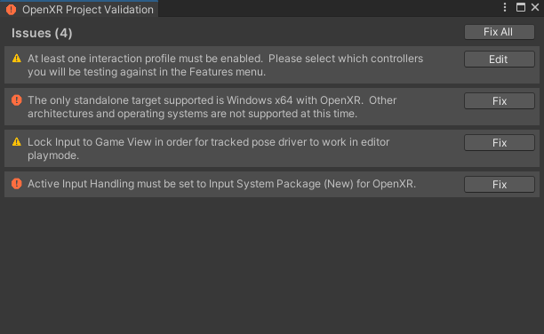

# Create OpenXR features

You can add features to Unity OpenXR to customize or support hardware and other OpenXR functionality not available in the Unity OpenXR package.

If you are creating multiple features and want to organize them in a group, refer to [Define a feature groups](xref:openxr-feature-groups).

If your feature requires a custom OpenXR loader library or a more recent version of the standard library than is currently available in the Unity OpenXR package, refer to [Require a custom loader library](xref:openxr-loader-library).

## Define an OpenXR feature

Unity OpenXR features are defined and executed in C#. C# can call to a custom native plug-in if desired. The feature can live somewhere in the user's project or in a package, and it can include any Assets that a normal Unity project would use.

A feature must override the `OpenXRFeature` ScriptableObject class. There are several methods that you can override on the `OpenXRFeature` class in order to do things like intercepting native OpenXR calls, obtaining the `xrInstance` and `xrSession` handles, starting Unity subsystems, etc.

A feature can add public fields for user configuration at build time. Unity renders these fields via a `PropertyDrawer` in the feature UI, and you can override them. Your feature can access any of the set values at runtime.

A feature must also provide an `OpenXRFeature` attribute when running in the Editor.

[!code-csharp[InterceptCreateSessionFeatureExample](../../../../com.unity.xr.openxr/Tests/Editor/CodeSamples/InterceptCreateSessionFeatureExample.cs#InterceptCreateSessionFeatureExample)]

Unity uses this information in the Editor, either to build the Player or to display it to the user in the OpenXR settings.

### Enabling OpenXR spec extension strings

Unity attempts to enable any extension strings listed in `OpenXRFeatureAttribute.OpenxrExtensionStrings` (separated via spaces) on startup. Your feature can check the enabled extensions to determine if the requested extension was enabled (via `OpenXRRuntime.IsExtensionEnabled`).

[!code-csharp[OnInstanceCreateExtensionCheckExample](../../../../com.unity.xr.openxr/Tests/Editor/CodeSamples/OnInstanceCreateExtensionCheckExample.cs#OnInstanceCreateExtensionCheckExample)]

### OpenXRFeature call order

The `OpenXRFeature` class has a number of methods that your method can override. Implement overrides to get called at specific points in the OpenXR application lifecycle.

#### Bootstrapping

`HookGetInstanceProcAddr`

This is the first callback invoked, giving your feature the ability to hook native OpenXR functions.

#### Initialize

`OnInstanceCreate => OnSystemChange => OnSubsystemCreate => OnSessionCreate`

The initialize sequence allows features to initialize Unity subsystems in the Loader callbacks and execute them when specific OpenXR resources are created or queried.

#### Start

`OnFormFactorChange => OnEnvironmentBlendModeChange => OnViewConfigurationTypeChange => OnSessionBegin =>  OnAppSpaceChange => OnSubsystemStart`

The Start sequence allows features to start Unity subsystems in the Loader callbacks and execute them when the session is created.

#### Game loop

Several: `OnSessionStateChange`

`OnSessionBegin`

Maybe: `OnSessionEnd`

Callbacks during the game loop can react to session state changes.

#### Stop

`OnSubsystemStop => OnSessionEnd`

#### Shut down

`OnSessionExiting => OnSubsystemDestroy => OnAppSpaceChange => OnSessionDestroy => OnInstanceDestroy`

### Build Time Processing

A feature can inject some logic into the Unity build process in order to do things like modify the manifest.

Typically, you can do this by implementing the following interfaces:

* `IPreprocessBuildWithReport`
* `IPostprocessBuildWithReport`
* `IPostGenerateGradleAndroidProject`

Features **should not** implement these classes, but should instead implement `OpenXRFeatureBuildHooks`, which only provide callbacks when the feature is enabled. For more information, refer to the [OpenXRFeatureBuildHooks](xref:UnityEditor.XR.OpenXR.Features.OpenXRFeatureBuildHooks) class.

### Build time validation

If your feature has project setup requirements or suggestions that require user acceptance, implement `GetValidationChecks`.  Features can add to a list of validation rules which Unity evaluates at build time. If any validation rule fails, Unity displays a dialog asking you to fix the error before proceeding. Unity can also present a warning through the same mechanism. It's important to note which build target the rules apply to.

Example:

[!code-csharp[BuildTimeValidationExample](../../../../com.unity.xr.openxr/Tests/Editor/CodeSamples/BuildTimeValidationExample.cs#BuildTimeValidationExample)]

### Feature native libraries

Any native libraries included in the same directory or a subdirectory of your feature will only be included in the built Player if your feature is enabled.
