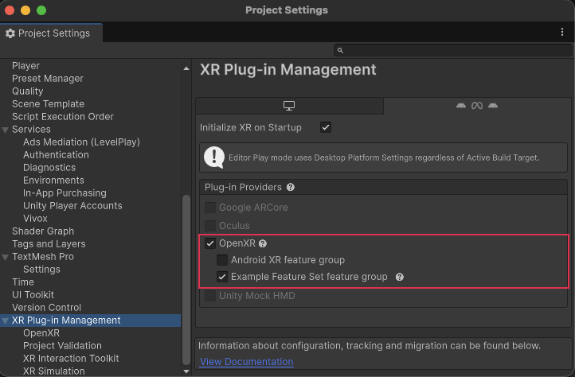
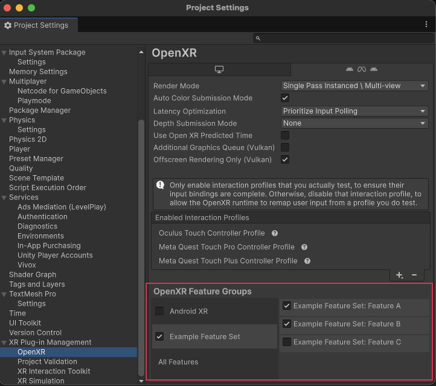

# Define feature groups

Unity OpenXR allows you to define a feature group you can use to organize a group of features.

## Declare an OpenXR Feature Set {#declare-feature-set}

Declare a feature group through the definition of one or more [OpenXRFeatureSetAttribute](xref:UnityEditor.XR.OpenXR.Features.OpenXRFeatureSetAttribute) declarations in your code. You can place the attribute anywhere because the feature group functionality only depends on the attribute existing and not on the actual class it's declared on.

The key attribute properties that you must set include:

* **FeatureIds**: The list of ids of the features in the group.
* **DefaultFeatureIds**: The ids of the features in the group to enable when the group is enabled in the [project settings](#group-settings).
* **UIName**: This value is the label shown in the **XR Plug-in Management** and OpenXR settings where users of your feature can choose to enable it.
* **BuildTargetGroups**: Determines which platforms your feature group can be enabled for.
* **Description**: Helps users of your feature group decide whether they need to enable it or not.
* **FeatureId**: This id is an arbitrary string that you create to uniquely identify your feature. To help ensure uniqueness, a reverse-domain-style name string should be used ("com.yourcompany.openxr.feature.set").

The following example shows how to decorate an empty class with an `OpenXRFeatureSetAttribute`:

``` cs
#if UNITY_EDITOR
using UnityEditor;
using UnityEditor.XR.OpenXR.Features;

namespace UnityEngine.XR.OpenXR.CodeSamples.Editor.Tests
{
    [OpenXRFeatureSet(
        FeatureIds = new string[] {
            ExampleFeatureA.featureId,
            ExampleFeatureB.featureId,
            "com.mycompany.myprovider.mynewfeature"
        },
        DefaultFeatureIds = new string[] {
            ExampleFeatureA.featureId,
            ExampleFeatureB.featureId
        },
        UiName = "Example Feature Set",
        Description = "Feature group that allows for setting up the best " +
                      "environment for My Company's hardware.",
        FeatureSetId = "com.mycompany.myprovider.mynewfeaturegroup",
        SupportedBuildTargets = new BuildTargetGroup[] {
            BuildTargetGroup.Standalone,
            BuildTargetGroup.Android
        }
    )]
    public class FeatureSetDefinitionExample { }
}
#endif
```

## Group settings {#group-settings}

A feature group shows up in two places in the Unity project settings.

On the **XR Plug-in Management** page, feature groups are listed with the platforms they support (determined by the targets you include in the [SupportedBuildTargets](xref:UnityEditor.XR.OpenXR.Features.OpenXRFeatureSetAttribute.SupportedBuildTargets) field):

<br />*Feature group shown in XR Plug-in Management settings*

On the **OpenXR** settings page, below **XR Plug-in Management**, feature groups are listed in the **OpenXR Feature Groups** section:

<br />*Feature group shown in OpenXR settings*

You can configure a feature group so that all or a subset of the group's features are enabled along with the group. To include a feature in this default set, add it to the [DefaultFeatureIds](xref:UnityEditor.XR.OpenXR.Features.OpenXRFeatureSetAttribute.DefaultFeatureIds) field of the `OpenXRFeatureSetAttribute`. When a developer using your feature group enables the check box in either location, the default features in the group are enabled.

> [!NOTE]
> The feature group checkbox doesn't simply toggle features on and off. When a developer unchecks the box for a feature group, the individual features retain their current state. The default features of the group are only affected at the time a developer enables the group.
