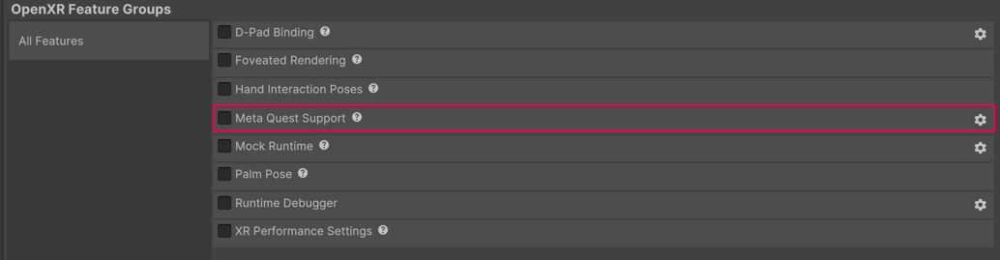

# Meta Quest Support

Understand how to configure the OpenXR plug-in for Meta Quest devices.

The Meta Quest Support feature enables Meta Quest support for the OpenXR plug-in. The **Meta Quest Support** window provides configurable settings specific for Meta Quest devices.

Refer to the following sections to understand how to [Enable Meta Quest Support](#Enable-support), and the [Settings](#settings) you can configure.

## Enable Meta Quest Support {#enable}

To deploy to Meta Quest, enable the Meta Quest Support feature on the Android build target as follows:

1. Open the Project Settings window (menu: **Edit > Project Settings**).
2. Select the **XR Plug-in Management** from the list of settings on the left.
3. If necessary, enable **OpenXR** in the list of **Plug-in Providers**. Unity installs the OpenXR plug-in, if not already installed.
4. Select the OpenXR settings page under XR Plug-in Management.
5. Add the **Oculus Touch Controller Profile** to the **Interaction Profiles** list. (You can have multiple profiles enabled in the list, the OpenXR chooses the one to use based on the current device at runtime.)
6. Enable **Meta Quest Support** under **OpenXR Feature Groups**.

When you enable Meta Quest Support, Unity produces Application Package Kit (APK) files that you can run on the Quest family of devices.

## Open the Meta Quest Support window

The **Meta Quest Support** settings window provides the settings you can configure for OpenXR support on Meta Quest devices.

To open the **Meta Quest Support** window:

1. Open the **OpenXR** section of **XR Plug-in Management** (menu: **Edit** > **Project Settings** > **XR Plug-in Management** > **OpenXR**).
2. Under **OpenXR Feature Groups**, enable **Meta Quest Support**.
3. Click the gear icon next to **Meta Quest Support** to open **Meta Quest Support** settings.

 *Meta Quest Support feature.*

## Settings reference {#settings}

The following sections provide a reference of the settings you can configure in the **Meta Quest Support** window.

### Rendering Settings

Use the following settings to configure rendering in your project:

| **Setting** | **Description** |
| :---------- | :-------------- |
| **Symmetric Projection (Vulkan)** | If enabled, when the application begins it will create a stereo symmetric view that changes the eye buffer resolution based on the Inter-Pupillary Distance (IPD). Provides a performance benefit across all IPD values. |
| **Optimize Buffer Discards (Vulkan)** | Enable this setting to enable an optimization that allows 4x Multi Sample Anti Aliasing (MSAA) textures to be memoryless on Vulkan. |
| **Multiview Render Regions Optimizations (Vulkan)** | Choose whether you enable Multiview Render Regions optimization and the mode of Multiview Render Regions optimization. In Unity 6.2 and newer, the options are: **None**, **All Passes**, **Final Pass**. To learn more about this feature, refer to [Multiview Render Regions](xref:openxr-multiview-render-regions). |
| **Space Warp motion vector texture format** | Choose the format used by the motion vector texture to store its values. The option you choose depends on whether you want to prioritize visual quality and performance.  The options you can use are:<ul><li><strong> RGBA16f: </strong> Use this for more precise values. This can improve the visual quality of Space Warp.</li><li><strong>RG16f: </strong>Use this option for reduced memory usage, but slightly less precision.</li></ul>To learn more about Space Warp, refer to [URP Application Spacewarp](xref:um-xr-application-spacewarp). |

### Manifest Settings

Use the following settings to configure your project manifest:

| **Setting** | **Description** |
| :---------- | :-------------- |
| **Force Remove Internet Permission** | Enable to force the removal of internet permissions added to the [Android App Manifest](xref:um-android-manifest). |
| **System Splash Screen** | Uses a `PNG` in the `Assets` folder as the system splash screen image. If set, the OS will display the system splash screen as a high quality compositor layer as soon as the app is starting to launch, until the app submits the first frame. Use the picker (&#8857;) to select an image from the `Assets` folder you want to use as the system splash screen image. |

### Target Devices

Select the Quest devices your project targets.

### Experimental

The **Experimental** section contains experimental settings that are under active development.

> [!NOTE]
> Experimental settings might change before they’re verified.

## Additional resources

* [Develop for Meta Quest](xref:um-xr-meta-quest-develop) (Unity manual)
* [Oculus All In on OpenXR: Deprecates Proprietary APIs](https://developer.oculus.com/blog/oculus-all-in-on-openxr-deprecates-proprietary-apis) (Meta developer blog)
