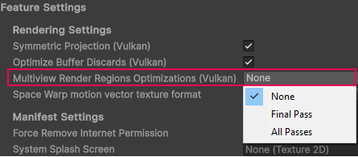

# Multiview Render Regions

The Multiview Render Regions feature is an optimization technique that prevents processing on areas of the screen that are not visible to the user.

For a detailed explanation of Multiview Render Regions, refer to [Multiview Render Regions](xref:um-xr-multiview-render-regions) in the Unity Manual.

## Prerequisites

To enable Multiview Render Regions, your project must meet the requirements outlined in [Prerequisites](xref:um-xr-multiview-render-regions#prerequisites) (Unity Manual).

## Enable Multiview Render Regions

To enable the Multiview Render Regions feature:

1. Open the **OpenXR** section of **XR Plug-in Management** (menu: **Edit** > **Project Settings** > **XR Plug-in Management** > **OpenXR**).
2. Under **All Features**, enable **Meta Quest Support**.
3. Use the **Gear** icon to open **Meta Quest Support** settings.
4. Under **Rendering Settings**, select the **Multiview Render Regions Optimizations** mode. To understand the available options refer to [Multiview Render Regions Optimizations reference](#reference).

 *Select the Multiview Render Regions Optimization mode in Rendering Settings.*

### Multiview Render Regions Optimizations reference

You can choose from the following options in the **Multiview Render Regions Optimizations** field:

| **Option** | **Description** |
| :--------- | :-------------- |
| **None**   | Disables Multiview Render regions. OpenXR enables **None** by default. |
| **Final Pass** | Enables Multiview Render Regions Optimizations for the final render pass only and is only applied to render passes that output to eye textures.  |
| **All Passes** | Applies Multiview Render Regions Optimizations for all passes that use multiview.

## Additional Notes

Several post-processing effects aren't compatible with Multiview Render Regions and can result in rendering artifacts. In Unity 6.3 and newer with render graph, Unity enables Multiview Render Regions only on passes where it increases performance and doesn't result in rendering artifacts. If render graph is not used in Unity 6.3, it's recommended to disable Multiview Render Regions to avoid decreased performance.