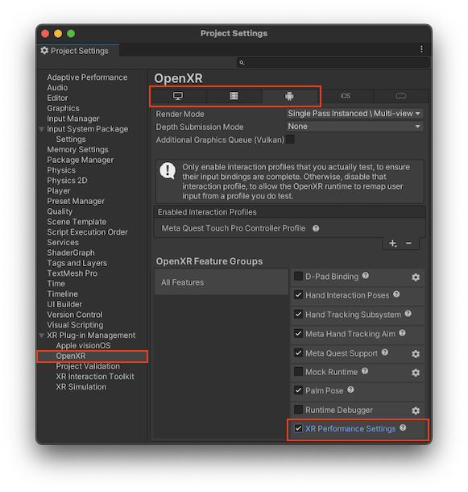

# XR performance settings

The OpenXR performance settings feature lets you provide performance hints to an OpenXR runtime and allows you to get notification when an important aspect of device performance changes.

XR devices must balance power and thermal state against performance to achieve an optimal user experience. You can provide performance hints to an OpenXR runtime to help it make the best tradeoffs for the task your application is running. For example, if your application is displaying a scene consisting of a loading graphic or simple menu without significant rendering requirements, you could tell the runtime to operate at a lower power level to save energy and thermal capacity for a later, more complex scene. Likewise, if you have a sequence that is very demanding, you could tell the runtime to operate at max capacity for a short time. You can provide hints separately for the CPU and the GPU. Refer to [Performance level hints](#performance-settings-level-hints) for more information.

You can subscribe to notifications that report changes in important aspects of device performance. These aspects include compositing, rendering, and thermal capacity. The performance notifications inform you when one of these performance categories changes between the normal, warning, and impaired states. The OpenXR runtime reports performance changes separately for the CPU and GPU. Your application can respond to these notifications by reducing the application workload. Refer to [Performance notifications](#performance-settings-notifications) for more information.

Refer to [Enable the performance settings OpenXR feature](#enable-performance-feature) for instructions about enabling the feature in your project.

> [!NOTE]
> The target XR platform must support the OpenXR "XR\_EXT\_performance\_settings" extension. Otherwise, the XR Performance Settings won't be activated at runtime. Be sure to confirm that your target platform supports the extension.

For more information about the OpenXR Performance Settings extension, refer to the [OpenXR Specification](https://registry.khronos.org/OpenXR/specs/1.0/html/xrspec.html#XR_EXT_performance_settings).

<a name="enable-performance-feature"></a>
## Enable the performance settings OpenXR feature

To use the performance settings API, you must enable it in the **OpenXR Project Settings**:

1. Open the **Project Settings** window (menu: **Edit > Project Settings**).
2. Expand the **XR Plug-in Management** section, if necessary.
3. Select the **OpenXR** area under **XR Plug-in Management**.
4. Choose the **Platform Build Target** from the tabs along the top of the **OpenXR** settings page.
5. Check the box next to **XR Performance Settings** (in the **All Features** group) to enable the feature.
6. Repeat for other platforms, if desired.



<a name="performance-settings-level-hints"></a>
## Performance level hints

The performance level hints help an OpenXR runtime balance the tradeoffs it must make between energy usage, thermal state, and your application's performance needs. You can provide separate hints for the CPU and GPU hardware domains.

You can set the following levels as hints about your application's current performance needs:

- **Power Savings**: At this level, the OpenXR runtime prioritizes energy conservation over consistent frame rendering and latency.
- **Sustained Low**: At this level, the OpenXR runtime tries to balance resource usage and high performance, prioritizing the former. Energy savings are prioritized over low latency, but the runtime tries to maintain a relatively stable frame rendering and XR compositing flow, as long as it's thermally sustainable.
- **Sustained High**: This level is the default hint, if none is set by your application. At this level, the OpenXR runtime prioritizes consistent rendering, XR compositing and latency in a thermal range that is sustainable.
- **Boost**: At this level, the OpenXR runtime allows maximum resource usage without trying to keep the device operating in a thermally sustainable range. If the device hardware exceeds its thermal limits, the runtime must throttle performance, so you should limit use of this performance level to short durations (less that 30 seconds).

> [!NOTE]
> When setting the Performance Level Hint to **Sustained Low** or **Sustained High** levels, your application can still experience performance throttling. For example, a device might exceed thermal limits due to external circumstances, such as operating in a high-temperature environment or for an extended amount of time. You can use [Performance Notifications](#performance-settings-notifications) to detect such impending performance issues and lower application workload before the runtime must impose throttling.

Use the static method, [XrPerformanceSettingsFeature.SetPerformanceLevelHint](xref:UnityEngine.XR.OpenXR.Features.Extensions.PerformanceSettings.XrPerformanceSettingsFeature.SetPerformanceLevelHint*) to set a given performance level hint for a specific CPU or GPU performance domain.


By choosing the lowest level that gives your application good performance, you can extend the device's battery life and avoid overheating. For example, you could set the **Power Savings** hint during loading screens. For normal operation, you could set **Sustained Low** for less demanding sequences, and **Sustained High** for more complex scenes. When appropriate, you could set the **Boost** hint to achieve maximum performance for a brief time.

Here are some examples of how you might use performance level hints in different scenarios:


- The application shows static pictures without any interactive elements:

  ```c#
  XrPerformanceSettingsFeature.SetPerformanceLevelHint(PerformanceDomain.CPU, PerformanceLevelHint.PowerSavings);
  XrPerformanceSettingsFeature.SetPerformanceLevelHint(PerformanceDomain.GPU, PerformanceLevelHint.PowerSavings);

  // Show a picture sequence and continue with app loading
  ```

- The application is in a normal state, with simple interactivity and low complexity scenes:

  ```c#
  XrPerformanceSettingsFeature.SetPerformanceLevelHint(PerformanceDomain.CPU, PerformanceLevelHint.SustainedLow);
  XrPerformanceSettingsFeature.SetPerformanceLevelHint(PerformanceDomain.GPU, PerformanceLevelHint.SustainedLow);

  // Run regular app process
  ```

- The application needs to render a complex scene with multiple, interactive composition layers:

  ```c#
  XrPerformanceSettingsFeature.SetPerformanceLevelHint(PerformanceDomain.GPU, PerformanceLevelHint.SustainedHigh);

  // Load and process action scene
  ```

- The application needs to process a large amount of data on device:

  ```c#
  XrPerformanceSettingsFeature.SetPerformanceLevelHint(PerformanceDomain.CPU, PerformanceLevelHint.Boost);

  // Run complex logic
  ```

<a name="performance-settings-notifications"></a>
## Performance notifications

The OpenXR runtime can inform your application about performance changes, so you can react and adjust the current workload, if desired.

Performance is categorized as one of the following performance states:

- **Normal**: No performance degradation is expected and the app can run as usual.
- **Warning**: The OpenXR runtime is expecting performance degradation if device conditions do not improve.
- **Impaired**: The device is suffering performance degradation.

An OpenXR runtime monitors performance of the device CPU and GPU across a set of key performance areas, called subdomains. These subdomains include:

* [Compositing](#compositing-subdomain): A runtime task that takes all rendered layers and combines them for display.
* [Rendering](#rendering-subdomain): Your application's timely submission of frames to the compositor.
* [Thermal](#thermal-subdomain): The hardware device's temperature compared to its thermal limits.

If the performance state of a subdomain changes, the [XrPerformanceSettingsFeature](xref:UnityEngine.XR.OpenXR.Features.Extensions.PerformanceSettings.XrPerformanceSettingsFeature.OnXrPerformanceChangeNotification) object dispatches an event that describes the change. Refer to [Subscribe to performance notifications](#subscribe) for information about handling this event.

When the performance state of a domain and subdomain changes for the worse, you should take mitigation measures that reduce application workload in that area. If you do not, the OpenXR runtime might impose its own, more drastic, measures.

After a sufficient period (determined by the runtime) of improved performance, a performance state can change from impaired to warning, and from warning to normal. Leaving the impaired state means that the runtime has stopped its own mitigation measures.

> [!TIP]
> Performance impairment may not be caused directly by your application, but by situational causes, such as high room temperature or a large amount of background tasks running on the device. Even so, the better you can tune your app to avoid performance degradation, the better the user experience will be across variable operating conditions.

<a name="compositing-subdomain"></a>
### Compositing subdomain

Compositing is a task performed by the OpenXR runtime to combine submitted frames for final display. The runtime must share CPU and GPU resources with your application while performing this task. If the runtime can't complete compositing in time, visual artifacts can occur. When in the impaired state, the OpenXR runtime might take actions that interfere with your application, such as limiting frame rate, ignoring submitted layers, or even shutting down the application.

* In the **Normal** state, the compositor can consistently finish with sufficient margin.
* In the **Warning** state, the compositor is finishing its task in time, but the margin is considered insufficient.
* In the **Impaired** state, the compositor cannot finish its task in time.

<a name="rendering-subdomain"></a>
### Rendering subdomain

Your application's rendering pipeline must submit rendered layers to the compositor for display. If frames aren't submitted in time for the compositor to use them, dropped frames and other artifacts can occur. In the impaired state, the OpenXR runtime might take actions that interfere with your application, such as telling the user that the application is unresponsive or displaying a tracking environment to maintain user orientation.

* In the **Normal** state, your application is consistently submitting rendered frames to the compositor in time to be used.
* In the **Warning** state, at least one layer is regularly submitted past the compositor deadline.
* In the **Impaired** state, late submission of frames has reached a critical threshold.

<a name="thermal-subdomain"></a>
### Thermal subdomain

XR devices must stay within a safe operating temperature. When a device reaches its thermal limits, the OpenXR runtime must take drastic measures to lower heat generation. These mitigations can severely impact the user experience.

* In the **Normal** state, the device is operating within a sustainable thermal range.
* In the **Warning** state, the OpenXR runtime anticipates that the device will soon overheat under the current load.
* In the **Impaired** state, the OpenXR is taking measures such as throttling performance, to reduce the device temperature.


<a name="subscribe"></a>
### Subscribe to performance notifications

Subscribe to the [XrPerformanceSettingsFeature.OnXrPerformanceChangeNotification](xref:UnityEngine.XR.OpenXR.Features.Extensions.PerformanceSettings.XrPerformanceSettingsFeature.OnXrPerformanceChangeNotification) event to receive an event when the performance state of a domain and subdomain changes.

A notification event provides the following data (as a [PerformanceChangeNotification](xref:UnityEngine.XR.OpenXR.Features.Extensions.PerformanceSettings.PerformanceChangeNotification) struct):

* Old performance state (normal, warning, or impaired)
* New performance state (normal, warning, or impaired)
* Affected domain (CPU or GPU)
* Affected subdomain (compositing, rendering, or thermal)

The following code snippet illustrates how you can subscribe to the performance notification event and handle performance changes (by calling your own application-defined functions that modify performance):

```c#
// Subscribe to the performance notification event at runtime
XrPerformanceSettingsFeature.OnXrPerformanceChangeNotification += OnPerformanceChangeNotification;

// Process the notification when it happens
void OnPerformanceChangeNotification(PerformanceChangeNotification notification)
{
    switch (notification.toLevel)
    {
        case PerformanceNotificationLevel.Normal:
            // Let the application run as normal execution
            RestorePerformance(notification.domain, notification.subDomain);
            break;
        case PerformanceNotificationLevel.Warning:
            // Reduce workload of low priority tasks
            LimitPerformance(notification.domain, notification.subDomain);
            break;
        case PerformanceNotificationLevel.Impaired:
            // Execute app with the minimum required processes for the given domain and subdomain
            ReducePerformance(notification.domain, notification.subDomain);
            break;
    }
}
```