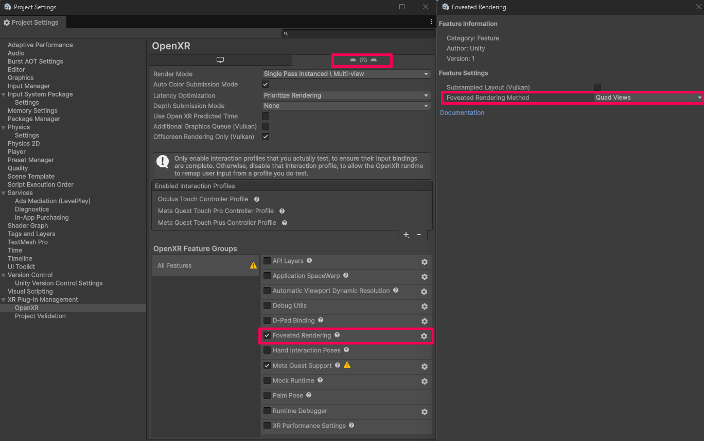

# Quad views

The Quad Views feature improves rendering performance by rendering two views per eye at different resolutions. In one view, the whole scene is rendered at a lower resolution. In the other view, a smaller area is rendered at a full resolution near the middle of the display. Because the periphery of the user's field of view is rendered at lower resolution, the time needed to render the scene is reduced. At the same time, the full-resolution inset where the user is most likely to focus their attention maintains perceived visual quality.

The quad views extension is a form of foveated rendering, but uses a different rendering approach. In some cases, quad views might render faster, while in others, foveated rendering might perform better. In addition, some headsets might not support both extensions. Refer to [Compare quad views and foveated rendering](#compare-quad-views-and-foveated-rendering) for more information.

To use the Quad Views feature in your application, you only need to turn the feature on as described in [Enable Quad Views feature](#enable-xr-quad-views). No other settings or configuration are needed.

Quad views are compatible with multiple render passes and post-processing. If you use quad views with single-pass instanced rendering enabled, the renderer performs two render passes, each rendering two views.

## Prerequisites

To use quad views, your Unity project must use:

* Unity 6.5+
* OpenXR 1.17+ package
* Meta Quest

In addition, to use quad views at runtime, the headset must support OpenXR API 1.0+. The XR runtime must be version 1.1.

> [!NOTE]
> If you are using a custom Scriptable Render Pipeline, it must handle two XRRenderPass calls and render correctly to each view.

> [!IMPORTANT]
> Quad Views is only supported when you set the OpenXR **Render Mode** to **Single Pass Instanced \ Multi-view**. Quad Views is not supported when you set the OpenXR **Render Mode** to **Multi-pass**, as performing four separate rendering passes does not achieve any performance improvement goals.

## Enable the Quad Views feature {#enable-xr-quad-views}

To enable quad views:

1. Open the **Project Settings** window (menu: **Edit \> Project Settings**).
2. Select the **OpenXR** settings page under **XR Plug-in Management**.
3. Select the **Android, Meta Quest, Android XR** tab.
4. Under **OpenXR Feature Groups**, select **All Features**.
5. Enable the **Foveated Rendering** feature.
6. Click the gear to open the Foveated Rendering feature sub-options.
7. On the Foveated Rendering sub-option window, select **Quad Views** for **Foveated Rendering Method**

   

> [!NOTE]
> The quad views implementation for a device determines the size, position, and resolution of the quad views. No additional options or runtime APIs for controlling quad views are available.

## Compare quad views and foveated rendering {#compare-quad-views-and-foveated-rendering}

Both quad views and [foveated rendering](xref:openxr-foveated-rendering) optimize scene rendering by rendering a central portion of the user's field of view at a higher resolution than the periphery. They use different rendering techniques that might make one more appropriate or perform better in your project than the other.

Use quad views when:

* you are using post-processing types that can't be used with foveated rendering
* the GPU is the predominate performance bottleneck of your app (GPU bound)

Use the foveated rendering when:

* the CPU is the predominate performance bottleneck of your app (CPU bound)
* eye tracking and gaze-based foveated rendering are available on the target device

You should always benchmark your app to confirm which technique performs better for your content, configuration, and target devices.

