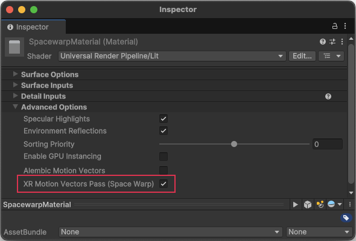

# Understand Application SpaceWarp

Application SpaceWarp synthesizes every other frame using data from previous frames. In addition to the standard eye buffer for the rendered scene, SpaceWarp requires a motion vector buffer and a depth buffer. The URP XR Pass renders these to low resolution motion vector and depth buffers.

To synthesize a frame, SpaceWarp shifts pixels from the previous rendered frame to a new, extrapolated position based on the motion vectors and depth. To decrease latency, the frame is reprojected using positional timewarp based on the latest available input pose.

> [!NOTE]
> Positional timewarp is a more effective form of reprojection that uses the update pose along with depth information to both translate and rotate the final frame. Technically, positional timewarp is a different feature than application SpaceWarp. Meta headsets automatically turn on positional timewarp when application SpaceWarp is active. Other headsets might not.

For additional information about Application SpaceWarp on Meta devices, refer to [Application SpaceWarp Developer Guide (Meta)](https://developers.meta.com/horizon/documentation/unity/unity-asw/).

## Limitations of SpaceWarp {#limitations}

* While SpaceWarp can improve your app's rendering performance, it doesn't simply double your frame rate. (Meta estimates a 70% improvement in the best cases for Quest headsets.) However, SpaceWarp doesn't work at all if your frame rate is already very low (around 18 fps or less).
* Frame synthesis can introduce visual artifacts such as distortion and stuttering. Refer to [Visual artifacts](#visual-artifacts).
* Not all objects can have SpaceWarp applied to them, which means they effectively render at half the framerate. Refer to [Unwarped objects](#unwarped-objects).
* Unity does not support using SpaceWarp in the [URP compatibility mode](xref:urp-compatibility-mode).

## Visual artifacts {#visual-artifacts}

Application SpaceWarp can cause visual artifacts. If you encounter such artifacts, you should evaluate whether you can eliminate or minimize them. In some cases, you'll need to decide whether the benefits of SpaceWarp outweigh observed problems that you can't avoid.

### Unwarped objects {#unwarped-objects}

If a moving object does not have motion vectors, then it can appear to stutter as it moves because its position is only updated in the rendered frames, not the synthesized frames. Still, there might be cases where things look better without SpaceWarp.

You can apply SpaceWarp to specific objects by changing the **XR Motion Vectors Pass (Space Warp)** property of their assigned Material. Objects with **XR Motion Vectors Pass (Space Warp)** disabled are not warped. Refer to [Configure Materials for SpaceWarp](xref:openxr-spacewarp-materials) for more information.

 *Material Inspector showing Advanced Options section.*

Unity also does not apply SpaceWarp to:

* Particle systems
* Objects that use materials with shaders that don't support SpaceWarp
* Composition layers (only the default scene layer is warped)

### Transparent objects {#transparent-objects}

SpaceWarp can cause artifacts when applied to transparent objects because the movement of objects behind a transparent object isn't captured in the motion vector and depth buffers. The artifacts can be more obvious when close to the camera.

In some cases, you can mitigate artifacts related to transparency by rendering such content to a composition layer. However, SpaceWarp is not applied to composition layers, so animation within a layer might appear choppy.

### Fast-moving objects {#fast-objects}

Objects moving with a high apparent velocity can create noticeable artifacts. When SpaceWarp moves the pixels rendered for an object, the algorithm distorts the background to fill any empty areas left in the object's wake. The more area an object covers and the farther it moves across the screen, the more likely this distortion will be noticeable. The characteristics of the background behind the object can also make a difference. For example a regular grid with straight lines might show the effects of the distortion more readily than a noisy texture. Objects that you "teleport" from one location to another can cause visual artifacts in the same manner.

In particular, you should evaluate the appearance of controller or hand graphics in your app. These are always close to the user, take up a large portion of the screen, and move at a high apparent velocity, all of which can accentuate SpaceWarp-related artifacts.
