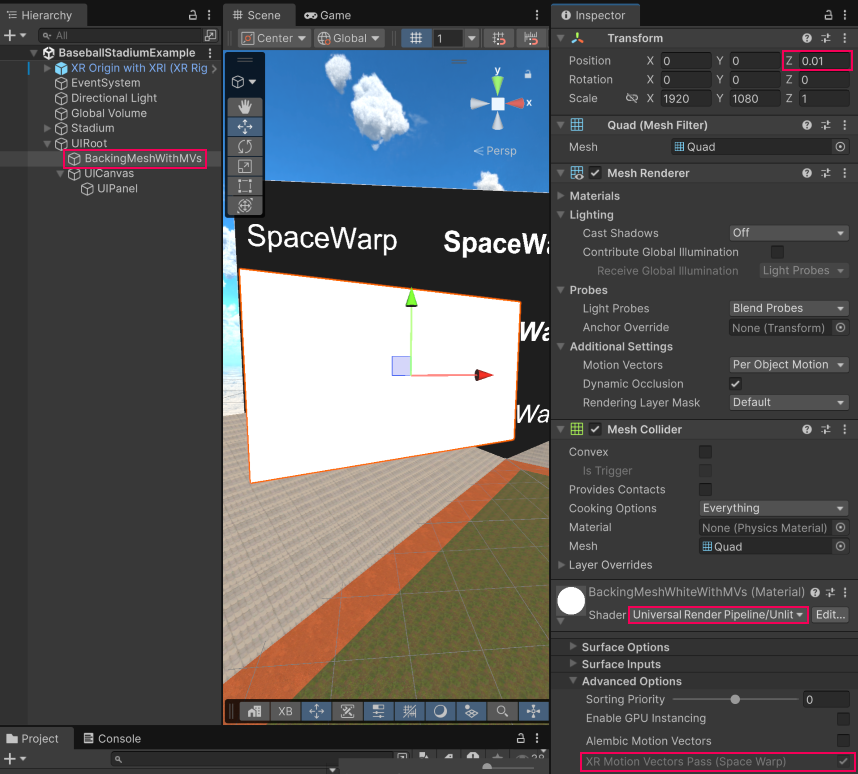

# UI incompatibility with SpaceWarp

Application SpaceWarp doesn't currently support UI elements, including those in the [TextMesh Pro](https://docs.unity3d.com/Packages/com.unity.ugui@latest?subfolder=/manual/TextMeshPro/index.html) and [Unity UI (uGUI)](https://docs.unity3d.com/Packages/com.unity.ugui@latest?subfolder=/manual/index.html) packages, because the default UI shaders, like `UI/Default`, don't [record motion vectors](xref:openxr-spacewarp-shaders).

Because UI material shaders don't set motion vectors, each pixel of a UI element in a scene uses the motion vector of the corresponding point on the nearest GameObject behind it. If there is no GameObject with a SpaceWarp-compatible material behind a pixel of a UI element, then the motion vector at that pixel is the zero vector (a vector containing only zeroes). As a result, some pixels of a UI element could have a non-zero motion vector, while other pixels of the same UI element could have the zero vector as its motion vector. This inconsistency can cause distortion or other rendering artifacts.

To work around this problem, you can place a GameObject that has a material with a SpaceWarp-compatible shader behind your UI. Refer to [UI incompatibility workaround](#ui-incompatibility-workaround) for more information.

For information on SpaceWarp-compatible shaders, refer to [Shaders and SpaceWarp](xref:openxr-spacewarp-shaders#compatible-urp-shaders).

## UI incompatibility workaround {#ui-incompatibility-workaround}

To prevent inconsistent and invalid motion vectors from being applied to your UI elements during SpaceWarp, you can place a GameObject behind your UI that uses a SpaceWarp-compatible shader. For example, you can place a Quad GameObject behind a UI Canvas and assign it a material that uses the `Universal Render Pipeline/Unlit` shader. During SpaceWarp rendering, the pixels in your UI use the motion vectors set by the shader in the backing GameObject.

When using this workaround, consider these additional factors:

* Application SpaceWarp doesn't currently support transparent GameObjects. Therefore, you can't have UI elements with transparent backgrounds that allow you to see the scene objects behind them. However, you can use alpha blending for the elements of the UI itself -- for example, for text and icons.
* When you have UI elements with complex shapes, you might need to create an appropriately shaped mesh to serve as a backdrop.
* Ensure that the backing GameObject behaves consistently with your UI. For example, if a UI element is invisible when viewed from behind, the backing GameObject might need to be set up the same way.

### UI workaround example

The following example illustrates how you can add a GameObject behind world-space UI elements to avoid SpaceWarp rendering artifacts:

1. Create an empty GameObject to serve as a root for your UI.
2. Add a UI Canvas for your UI element as a child of this root GameObject.
3. In the Inspector window for the new UI Canvas GameObject, find the Canvas component and set the **Render Mode** field to **World Space**. SpaceWarp isn't compatible with screen space elements.
4. Add a Quad, or other GameObject providing a suitable mesh, as a child of the same root GameObject.
5. Position this GameObject slightly behind the UI element.
6. Assign a SpaceWarp-compatible material to the **Mesh Renderer** component, such as one that uses the shader `Universal Render Pipeline/Unlit`.
7. Expand the material's **Advanced Options** section and enable **XR Motion Vectors Pass (Space Warp)**.

 *A UI element with a SpaceWarp compatible backing mesh behind it*

> [!NOTE]
> If you scale the root GameObject in this workaround example, the distance between the UI Canvas and the backing GameObject also changes. In this situation, [Z-fighting](https://en.wikipedia.org/wiki/Z-fighting) can occur if the distance between the UI Canvas and the GameObject becomes too small. You can avoid Z-fighting by scaling the UI Canvas and GameObject independently.
