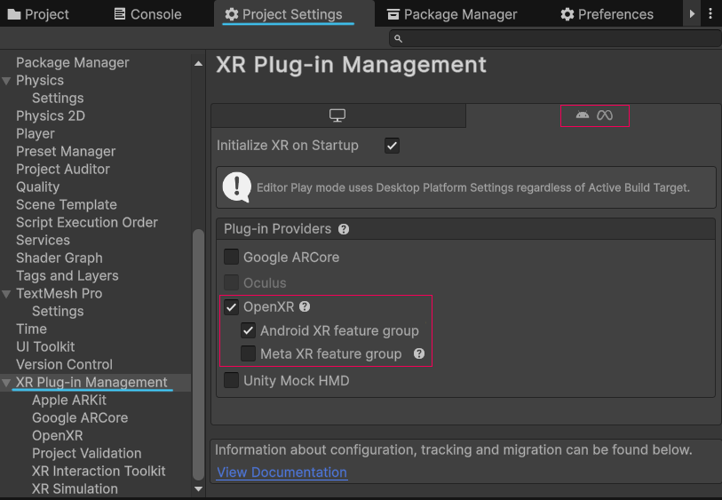
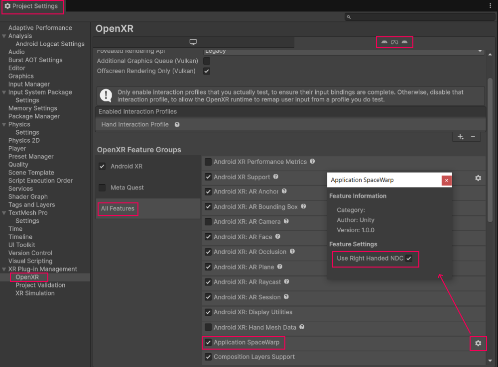

# Enable and use Application SpaceWarp {#enable-and-use-spacewarp}

To enable and use Application SpaceWarp in your project, complete the following steps:

1. [Enable the OpenXR SpaceWarp feature](#enable-spacewarp) in the Editor.
2. [Control SpaceWarp at runtime](#control-spacewarp).
3. Choose [compatible URP shaders](xref:openxr-spacewarp-shaders#compatible-urp-shaders) and [modify custom shaders](xref:openxr-spacewarp-shaders#modify-custom-shaders) to support SpaceWarp, if necessary.
4. [Configure Materials for SpaceWarp](xref:openxr-spacewarp-materials).

> [!IMPORTANT]
> Android XR devices use right-handed normalized device coordinates (NDC) for motion vectors.
> Right-handed NDC for motion vectors are only supported in Unity 6000.1.13f1+ and OpenXR 1.15.1+.
> If unsure of your device's NDC requirements, refer to the device specifications for more information.

## Enable the OpenXR SpaceWarp feature in the Editor {#enable-spacewarp}

To enable Application SpaceWarp, do the following:

1. Open your **Project Settings** in the Unity Editor (menu: **Edit > Project Settings**).
2. Select the **XR Plug-in Management** settings.
3. Choose the tab at the top corresponding to your current XR device.
4. Enable the **OpenXR** checkbox, if necessary.
5. Enable the appropriate checkbox under the **OpenXR** checkbox according to the feature group for your device:

    *Select the OpenXR Plug-in and correct feature group for the current device*

   > [!NOTE]
   > If the options to enable the feature group for your device are missing, you might need to install an OpenXR device package. Refer to [Prerequisites](xref:openxr-spacewarp-prerequisites) for more information.

6. Switch to the **OpenXR** settings page (underneath **XR Plug-in Management**).
7. Choose the tab at the top corresponding to your current XR device.
8. Select the **All Features** group.
9. Enable the **Application SpaceWarp** feature.

    *Enable the Application SpaceWarp feature*

   > [!NOTE]
   > If using Unity 6000.1.13f1+ and OpenXR 1.15.1+, there will be a gear icon to the right of the feature name.

10. If a gear icon is present to the right of the feature, click it to reveal a window and a checkbox that says **Use Right Handed NDC**. Your XR device may require right-handed normalized device coordinates (NDC) for its motion vectors in order for SpaceWarp to work properly. Refer to [Enable and use Application SpaceWarp](#enable-and-use-spacewarp) for more information. If your device does require right-handed NDC, make sure the **Use Right Handed NDC** box is checked, otherwise, uncheck it.

> [!IMPORTANT]
> After enabling Application SpaceWarp in the Editor, you must also use the runtime API to turn the feature on at start up and update the camera position and rotation every frame. Refer to [Control SpaceWarp at runtime](#control-spacewarp) for more information.

## Control SpaceWarp at runtime {#control-spacewarp}

To use Application SpaceWarp, you need to:

1. Turn the feature on at runtime with the [SpaceWarpFeature.SetSpaceWarp(bool)](xref:UnityEngine.XR.OpenXR.Features.SpaceWarpFeature.SetSpaceWarp(System.Boolean)) method.
2. Update the camera position and runtime every frame with:

   * [SetAppSpacePosition(Vector3)](xref:UnityEngine.XR.OpenXR.Features.SpaceWarpFeature.SetAppSpacePosition(UnityEngine.Vector3))
   * [SetAppSpaceRotation(Quaternion)](xref:UnityEngine.XR.OpenXR.Features.SpaceWarpFeature.SetAppSpaceRotation(UnityEngine.Quaternion))

The following MonoBehaviour script, which you attach to the main camera in your scene, illustrates how to do this:

[!code-csharp[SpaceWarpControllerExample](../../../../com.unity.xr.openxr/Tests/Editor/CodeSamples/SpaceWarpControllerExample.cs#SpaceWarpControllerExample)]

> [!TIP]
> You can use [SpaceWarpFeature.SetSpaceWarp(bool)](xref:UnityEngine.XR.OpenXR.Features.SpaceWarpFeature.SetSpaceWarp(System.Boolean)) to turn SpaceWarp on and off for sequences of content that do not work well under Application SpaceWarp.
