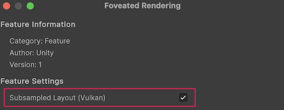

# Subsampled layout

Subsampled layout is an optimization technique that can improve [Foveated rendering](xref:openxr-foveated-rendering) performance by optimizing eye texture sampling.

## Prerequisites

To enable subsampled layout, your project must meet the following requirements:

* Unity 6.0 or newer.
* Use the Vulkan API. This feature isn't available on other graphics APIs. To understand how to choose your graphics API, refer to [Configure graphics APIs](https://docs.unity3d.com/Manual/configure-graphicsAPIs.html).

### Feature compatibility

* Using subsampled layout with [Application SpaceWarp](xref:openxr-spacewarp) might introduce additional compositor GPU cost, but can still improve overall performance.

## Enable Subsampled Layout

To enable subsampled layout in the Unity Editor:

1. Open the **OpenXR** section of **XR Plug-in Management** (menu: **Edit** > **Project Settings** > **XR Plug-in Management** > **OpenXR**).
2. Under **All Features**, enable **Foveated Rendering**.
3. Use the **Gear** icon to open **Foveated Rendering** settings.
4. Under **Feature Settings**, enable **Subsampled Layout (Vulkan)**.

<br/>*Enable the Subsampled Layout setting.*

### Enable at runtime

You can also enable subsampled layout at runtime through the foveated rendering feature. To enable subsampled layout at runtime, use the [TrySetSubsampledLayoutEnabled](xref:UnityEngine.XR.OpenXR.Features.FoveatedRenderingFeature.TrySetSubsampledLayoutEnabled*) API:

``` csharp
using UnityEngine;
using UnityEngine.XR.OpenXR.Features;

public class SubsampledLayoutEnabler : MonoBehaviour
{
    void Start()
    {
        FoveatedRenderingFeature.TrySetSubsampledLayoutEnabled(true);
    }
}
```