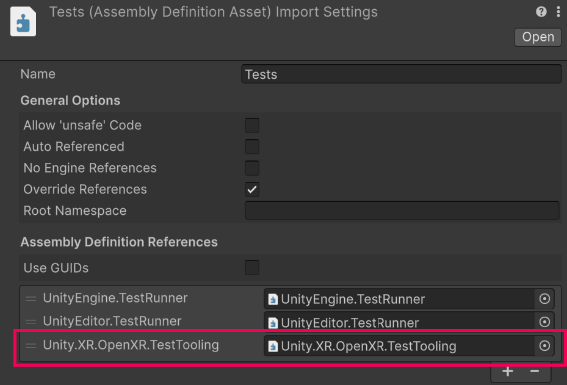

# Low-level testing with Mock OpenXR Environment

The Mock OpenXR Environment is an API built on top of the Mock Runtime feature that allows you to test native, low-level code that makes use of the OpenXR functions. The API is designed to help you create Unity Test Framework or NUnit tests that validate new features requiring a native plugin that interacts with the OpenXR runtime, or that depend on the newest or experimental OpenXR extensions.

The Mock OpenXR Environment supports Standalone (Windows and MacOS) and Android.

> [!IMPORTANT]
> The  Mock OpenXR Environment feature cannot be used as an interactive replacement for a physical XR device for prototyping and Play mode testing. For these cases, its recommended to use a plugin such as [Unity MockHMD](https://docs.unity3d.com/Packages/com.unity.xr.mock-hmd@1.4/manual/index.html), [Meta XR Simulator](https://developers.meta.com/horizon/documentation/unity/xrsim-intro/) or [Android XR Emulator](https://developer.android.com/develop/xr/jetpack-xr-sdk/studio-tools).

## Initial setup and execution of a test case

Before using the Mock OpenXR Environment in your tests, you need to set up your project's test assembly to reference the Mock OpenXR Environment assembly. In your test folder's Assembly Definition, add a reference to the `Unity.XR.OpenXR.TestTooling` assembly.

<br />*Test assembly definition asset settings referencing Unity.XR.OpenXR.TestTooling assembly*

You can initialize a new [`MockOpenXREnvironment`](xref:UnityEngine.XR.OpenXR.TestTooling.MockOpenXREnvironment) instance with the following instruction. With the `using` declaration, the mock environment will be automatically stopped once its containing code block ends, as well as clearing out any modifications done to the OpenXR settings.

``` csharp
using var MyMockEnvironment = MockOpenXREnvironment.CreateCreateEnvironment();
```

You can also initialize the test environment for reusing the same mock environment across multiple tests. Note that this approach will make settings modifications propagate between test cases, so make sure to restore case-specific modifications once the test case concludes.

``` csharp
[BeforeTest]
void SetUp()
{
    MyMockEnvironment = MockOpenXREnvironment.CreateCreateEnvironment();
}

[AfterTest]
void TearDown()
{
    MyMockEnvironment.Dispose();
}
```

> [!NOTE]
> Only one MockOpenXREnvironment is allowed to be active concurrently. Creating multiple mock environment instances and running tests in parallel will produce runtime errors and resource conflicts.

Once a mock environment has been created, you can set up the environment before starting the Mock Runtime. For example, your test can enable your custom OpenXR feature or request additional OpenXR extensions.

``` csharp
var MyMockSettings = MyMockEnvironment.Settings;
// Activate a custom OpenXR feature
MyMockSettings.EnableFeature<MyCustomFeature>();
// Request an extension
MyMockSettings.RequestUseExtension("XR_CUSTOM_EXTENSION");
```

After completing your test's setup, you can start the Mock Runtime with the [`MockOpenXREnvironment.Start`](xref:UnityEngine.XR.OpenXR.TestTooling.MockOpenXREnvironmentSettings.Start*) method. This method does the following:

- Initializes the Unity OpenXR plugin
- Loads all active features and its respective libraries
- Initialize the Mock Runtime
- Starts a new OpenXR instance and session

``` csharp
MyMockEnvironment.Start();
```

Once you have finished running your test case in the runtime, you can manually stop the runtime with the [`MockOpenXREnvironment.Stop`](xref:UnityEngine.XR.OpenXR.TestTooling.MockOpenXREnvironmentSettings.Stop*) method. You must stop the Mock OpenXR Environment instance in tests that share their mock environment with other test cases.
You can stop and start the mock environment instance in the same test.

``` csharp
MyMockEnvironment.Stop();
```

The following code example shows a complete example of the basic implementation.

``` csharp
using NUnit.Framework;
using UnityEngine.XR.OpenXR.TestTooling;

namespace UnityEngine.XR.OpenXR.CodeSamples.Editor.Tests
{
    public class MockOpenXREnvironmentBasicsExample
    {
        [Test]
        public void TestUsingMockOpenXREnvironment()
        {
            using var MyMockEnvironment = MockOpenXREnvironment.CreateEnvironment();

            // Create temporary settings used for the test
            var MyMockSettings = MyMockEnvironment.Settings;

            // Modify OpenXR settings that will be used in the test case.

            // Start Mock Runtime
            MyMockEnvironment.Start();

            // Run test scenario

            // Validate test
        }
    }
}
```

## Changing OpenXR settings for the test run

You can use the [`MockOpenXREnvironmentSettings`](xref:UnityEngine.XR.OpenXR.TestTooling.MockOpenXREnvironmentSettings) instance to enable OpenXR features and ask the Unity OpenXR plugin to request specific OpenXR extensions.

When a new [`MockOpenXREnvironment`](xref:UnityEngine.XR.OpenXR.TestTooling.MockOpenXREnvironment) instance is created, a [`MockOpenXREnvironmentSettings`](xref:UnityEngine.XR.OpenXR.TestTooling.MockOpenXREnvironmentSettings) object is built alongside it.

## Adding mock support for new extensions

The Mock Runtime only implements the core OpenXR functions, so to test functions specific to a given OpenXR extension, you must perform additional steps. These steps configure the Mock Runtime to identify the extension and discover its corresponding functions when requested by the native code. This way, you can define customized functions that behave accordingly to the scenario your test is validating.

To set up mocked extension support, you need to do the following steps:

1. Declare the extension's mock function interceptors. The Mock Runtime provides these extension function pointers when receiving calls by `xrGetInstanceProcAddr`.

    The extension's function interceptors can be implemented as native code or as C# unsafe static functions. In both cases, you must marshal them as native function pointers that are passed to Mock Runtime.

    If you use C# function interceptors, you must also declare C# structs whose binary layout exactly matches that of the native structs as defined by the extension specification. See the [UnityEngine.XR.OpenXR.Native](xref:UnityEngine.XR.OpenXR.NativeTypes) namespace for existing OpenXR native types implemented by the Unity OpenXR plugin that can be reused in your test code.

    Note that you don't need to implement function interceptors for each of the OpenXR extension's functions, only declare interceptors for the functions used by the code your test validates.

    Here is an example declaration for a C#-based function interceptor:

    ``` csharp
    // Declare the delegate that can be used as a function pointer type
    unsafe delegate XrResult MyCustomExtensionFunction_Delegate(XrInstance instance);

    // This is the function interceptor that Mock Runtime will return when the XR app requests the function pointer for "xrMyCustomExtensionFunction"
    [MonoPInvokeCallback(typeof(MyCustomExtensionFunction_Delegate))]
    static unsafe XrResult MyFunctionInterceptor(XrInstance instance)
    {
        // Perform mock behavior here
        return XrResult.Success;
    }

    // The function interceptor needs to be marshalled into a pointer that the Mock Runtime can use as a native function pointer
    static unsafe IntPtr GetFunctionInterceptor() => Marshal.GetFunctionPointerForDelegate((MyCustomExtensionFunction_Delegate)MyFunctionInterceptor);
    ```

    > [!IMPORTANT]
    > Do not perform assertions directly inside a mocked function interceptor's code block. Assertions throw managed exceptions that the native code in Mock Runtime can't handle, potentially causing a crash. Instead, use static variables to store the internal state of your function interceptor, and then, in your test, execute the assertions.

    The following example demonstrates a function interceptor that can provoke a crash when the assertion fails:

    ``` csharp
    static unsafe XrResult FunctionInterceptorThatCausesCrash(XrInstance instance)
    {
        Assert.IsTrue(instance != 0); // This line will cause a crash if the assertion fails
        return XrResult.Success;
    }
    ```

    The following example demonstrates the recommended approach for validating a call performed to a function interceptor, that can be validated later:

    ``` csharp
    static bool s_instanceExist = false; // Use this variable later for validating the expected state in the test body

    static unsafe XrResult FunctionInterceptorForSafeValidation(XrInstance instance)
    {
        s_instanceExist = instance != 0; // Save the state to validate in a static variable
        return XrResult.Success;
    }

    [UnityTest]
    IEnumerator TestWithFunctionInterceptor()
    {
        // Setup test case

        MyMockEnvironment.Start();
        yield return null;
        // Validate expected state.
        Assert.IsTrue(s_instanceExist);
    }
    ```

2. Register the extension's name string during your test setup. This allows the Mock Runtime to list your provided extension name string when receiving `xrEnumerateInstanceExtensionProperties` calls, and to handle `xrCreateInstance` calls successfully when the Unity OpenXR plugin requests your provided extension name string.

    ``` csharp
    MyMockEnvironment.AddSupportedExtension("XR_CUSTOM_EXTENSION", XR_CUSTOM_EXTENSION_SPEC_VERSION)
    ```

3. Then you need to request your extension to be activated during initialization. You can do this in two ways:

    1. By requesting the Mock OpenXR Environment's settings instance to use an specific extension.

        ``` csharp
        MyMockEnvironment.Settings.RequestUseExtension("XR_CUSTOM_EXTENSION");
        ```

    2. By enabling an OpenXR Feature that makes use of the extension your test requires. You should only enable an OpenXR feature that both your test case and the code under validation require. See [Integrate OpenXR features](./features/feature-integration.md) on how the OpenXR features declare and request extension features.

        Here's an example feature declaring usage of an OpenXR extension:
        ``` csharp
        // In the custom feature code, the OpenXRFeature attribute declares which extensions will be required by this feature
        #if UNITY_EDITOR
        [OpenXRFeature(UiName = "My Custom Feature",
            Desc = "Necessary to deploy a Meta Quest compatible app.",
            OpenxrExtensionStrings = "XR_CUSTOM_EXTENSION", // Example of declaring a custom feature to request
            Version = "1.0.0",
            FeatureId = "com.company.xr.customFeature"
        )]
        #endif
        public class MyCustomFeature : OpenXRFeature {}
        ```

        Then, in your test setup code, you need to enable the OpenXR feature that makes use of your required extension, as in this example:
        ``` csharp
        MyMockEnvironment.Settings.EnableFeature<MyCustomFeature>(true);
        ```

4. Finally, you need to provide the function name to intercept and corresponding function pointer for each of the OpenXR extension functions you want the Mock Runtime to use. These must be set up before starting the MockRuntime.

    ``` csharp
    [Test]
    void AFunctionInterceptorTest()
    {
        using var MyMockEnvironment = MockOpenXREnvironment.CreateCreateEnvironment();
        // Declare extension required when creating an OpenXR instance
        MyMockEnvironment.Settings.RequestUseExtension("XR_CUSTOM_EXTENSION");

        // Then, in the test setup, provide the name of the function to be intercepted and the function pointer
        MyMockEnvironment.SetFunctionForInterceptor("xrMyCustomExtensionFunction", GetFunctionInterceptor());

        // Finally, start test and run validations
    }
    ```

Here's the complete example of a test injecting a mock function interceptor, using a C# function interceptor, and requesting a specific OpenXR extension from the Mock OpenXR Environment instance:

``` csharp
public class MyMockFunctionInterceptorTest
{
    // Delegate for marshaling a function pointer for the XR function interceptor
    unsafe delegate XrResult MyCustomExtensionFunction_Delegate(XrInstance instance);

    // Function interceptor for the XR function "xrMyCustomExtensionFunction"
    [MonoPInvokeCallback(typeof(MyCustomExtensionFunction_Delegate))]
    static unsafe XrResult MyFunctionInterceptor(XrInstance instance)
    {
        MyFunctionWasCalled = true;
        return XrResult.Success;
    }

    // Getter for marshaling the function pointer
    static unsafe IntPtr GetFunctionInterceptor() => Marshal.GetFunctionPointerForDelegate((MyCustomExtensionFunction_Delegate)MyFunctionInterceptor);

    // Variable used to check if the XR function interceptor was called by native code
    static bool MyFunctionWasCalled = false;

    [AfterTest]
    void TearDown()
    {
        // Reset any static variables used for validation
        MyFunctionWasCalled = false;
    }

    [UnityTest]
    IEnumerator AFunctionInterceptorTest()
    {
        // Setup the Mock OpenXR Environment instance
        using var MyMockEnvironment = MockOpenXREnvironment.CreateCreateEnvironment();
        MyMockEnvironment.Settings.RequestUseExtension("XR_CUSTOM_EXTENSION");
        MyMockEnvironment.SetFunctionForInterceptor("xrMyCustomExtensionFunction", GetFunctionInterceptor());

        // Start Mock Runtime and initialize Unity OpenXR SDK
        MyMockEnvironment.Start();

        // Wait one frame to let initialization complete
        yield return null;

        // Validate results
        Assert.IsTrue(MyFunctionWasCalled);
    }
}
```

## Modifying Mock Runtime's system properties

Your feature may have software functionality that depends on the device form factor and its available hardware components. In these situations, it is useful for your feature to adapt its software components based on the device capabilites. For testing a scenario like this, the Mock OpenXR Environment provides an entry point for intercepting calls requesting an specific system properties type, and injecting the Mock Runtime with the system properties structs that you need. For more details on the way OpenXR specification, refer to [the System section in the OpenXR specification](https://registry.khronos.org/OpenXR/specs/1.1/html/xrspec.html#system) for additional details on the system properties, available functions and structures.

The system properties function is passed to Mock Runtime as a native pointer. You can implement this function as either a native function or an unsafe static C# method.  When you implement the system properties in C#, you must declare any OpenXR extension structs required by your test case in such a way that the binary layout of these new structs exactly matches the types and alignment of the native structs defined by the OpenXR specification. See the [UnityEngine.XR.OpenXR.Native](xref:UnityEngine.XR.OpenXR.NativeTypes) namespace for existing OpenXR native types implemented by the Unity OpenXR plugin that can be reused in your test code.

To set up the system properties provider function, you must declare a delegate and the system provider function to use, which then will be marshaled into a function pointer. The following example shows how to declare a system properties provider function:

``` csharp
// Native type required as argument for the native system properties function, partially matching OpenXR's XrSystemProperties definition
unsafe struct XrSystemPropertiesHeader
{
    internal XrStructureType type;
    internal void* next;
}

// Delegate for marshaling a function pointer for the system properties provider function
unsafe delegate XrResult GetSystemProperties_Delegate(XrSystemPropertiesHeader* systemPropertiesStruct);

[MonoPInvokeCallback(typeof(GetSystemProperties_Delegate))]
static unsafe XrResult SysProperties_UserPresence_MockCallback(XrSystemPropertiesHeader* systemPropertiesStruct)
{
    // Here you add the mock code handling the systemPropertiesStruct according to your test scenario
    return XrResult.Success;
}

// Getter for marshaling the function pointer
static unsafe IntPtr GetSysProperties_UserPresence_MockCallback() => Marshal.GetFunctionPointerForDelegate((GetSystemProperties_Delegate)SysProperties_UserPresence_MockCallback);
```

Then, during your test setup, you need to configure the Mock Runtime to use your desired system properties provider function with the [`MockOpenXREnvironment.SetSysPropertiesFunctionForXrStructureType`](xref:UnityEngine.XR.OpenXR.TestTooling.MockOpenXrEnvironment.SetSysPropertiesFunctionForXrStructureType*) method:

``` csharp
using var MyMockEnvironment = MockOpenXREnvironment.Create();
MyMockEnvironment.SetSysPropertiesFunctionForXrStructureType(XR_TYPE_SYSTEM_USER_PRESENCE_PROPERTIES_EXT, GetSysProperties_UserPresence_MockCallback());
```

You can remove a mocked system properties provider function associated with a given system properties type by passing over a null pointer:

``` csharp
MyMockEnvironment.SetSysPropertiesFunctionForXrStructureType(XR_TYPE_SYSTEM_USER_PRESENCE_PROPERTIES_EXT, IntPtr.Zero);
```

Here's the complete example of a test implementing a system properties provider function:

``` csharp
public class SystemPropertiesTest
{
    unsafe struct XrSystemPropertiesHeader
    {
        internal XrStructureType type;
        internal void* next;
    }

    unsafe delegate XrResult GetSystemProperties_Delegate(XrSystemPropertiesHeader* systemPropertiesStruct);

    [MonoPInvokeCallback(typeof(GetSystemProperties_Delegate))]
    static unsafe XrResult SysProperties_UserPresence_MockCallback(XrSystemPropertiesHeader* systemPropertiesStruct)
    {
        s_NumTimesMockSysPropertiesCalled++;
        return XrResult.Success;
    }

    static unsafe IntPtr GetSysProperties_UserPresence_MockCallback() => Marshal.GetFunctionPointerForDelegate((GetSystemProperties_Delegate)SysProperties_UserPresence_MockCallback);

    static uint s_NumTimesMockSysPropertiesCalled;

    [AfterTest]
    void TearDown()
    {
        // Reset any static variables used for validation
        s_NumTimesMockSysPropertiesCalled = 0;
    }

    [UnityTest]
    public IEnumerator TestSetSysPropsFunctionForXrStructureType()
    {
        using (var mockRuntimeEnvironment = MockOpenXREnvironment.CreateEnvironment())
        {
            mockRuntimeEnvironment.SetSysPropertiesFunctionForXrStructureType(
                XR_TYPE_SYSTEM_USER_PRESENCE_PROPERTIES_EXT,
                GetSysProperties_UserPresence_MockCallback());
            s_NumTimesMockSysPropertiesCalled = 0;
            mockRuntimeEnvironment.Start();
            yield return new WaitForSeconds(0.1F);
            Assert.IsTrue(s_NumTimesMockSysPropertiesCalled > 0);
            mockRuntimeEnvironment.Stop();
            yield return new WaitForSeconds(0.1F);
        }
    }
}
```

> [!IMPORTANT]
> Do not perform assertions directly inside a system properties provider function's code block. Assertions throw managed exceptions that the native code in Mock Runtime can't handle, potentially causing a crash. Instead, use static variables to store the internal state of your system properties provider function, and then, in your test, execute the assertions.

The following example demonstrates a system properties provider function that can provoke a crash when the assertion fails:

``` csharp
static unsafe XrResult SysProperties_UserPresence_MockCallback(XrInstance instance)
{
    Assert.IsTrue(instance != 0); // This line will cause a crash if the assertion fails
    return XrResult.Success;
}
```

The following example demonstrates the recommended approach for validating a call performed to a system properties provider function, that can be validated later:

``` csharp
static bool s_instanceExist = false; // Use this variable later for validating the expected state in the test body

static unsafe XrResult SysProperties_UserPresence_MockCallback(XrInstance instance)
{
    s_instanceExist = instance != 0; // Save the state to validate in a static variable
    return XrResult.Success;
}

[UnityTest]
IEnumerator TestWithSystemPropertiesProvider()
{
    // Setup test case with system properties provider

    MyMockEnvironment.Start();
    yield return null;
    // Validate expected state.
    Assert.IsTrue(s_instanceExist);
}
```

## Queueing OpenXR events

If your application needs to react to events sent from the OpenXR runtime, the Mock OpenXR Environment provides a mechanism for enqueuing the required events. Events must be sent after the Mock Runtime is running with the [`MockOpenXrEnvironment.Start`](xref:UnityEngine.XR.OpenXR.TestTooling.MockOpenXrEnvironment.Start*) method.

1. The [`EnqueueMockEventData`](xref:UnityEngine.XR.OpenXR.TestTooling.MockOpenXrEnvironment.EnqueueMockEventData*) method allows you to enqueue native events into the Mock Runtime for processing. The event payload must be presented as native structure pointer, so when using a C# struct, you need to ensure that the struct binary layout exactly matches its corresponding native struct, and then marshal the managed structure to an unmanaged block of memory.
2. The [`ProcessEventQueue`](xref:UnityEngine.XR.OpenXR.TestTooling.MockOpenXrEnvironment.ProcessEventQueue*) method lets you signal the Mock Runtime that it should send all the queued events to your XR app.

Here's an example on how to enqueue an event based on the OpenXR extension `XrEventDataUserPresenceChangedEXT`.

``` csharp
// Example queue event to set userPresent to False.
var userPresenceEventData = new XrEventDataUserPresenceChangedEXT
{
    type = XR_TYPE_EVENT_DATA_USER_PRESENCE_CHANGED_EXT,
    next = null,
    isUserPresent = 0 // Set userPresent to False
};

// Marshal structure for enqueuing it into native Mock Runtime
IntPtr unmanagedEventData = Marshal.AllocHGlobal(EventDataBufferSize);
Marshal.StructureToPtr(userPresenceEventData, unmanagedEventData, false);
mockRuntimeEnvironment.EnqueueMockEventData(unmanagedEventData);
Marshal.FreeHGlobal(unmanagedEventData);

// Send all the queued events
mockRuntimeEnvironment.ProcessEventQueue();
```

For more details on how OpenXR handles event polling and queueing, please refer to [the specification section on Events](https://registry.khronos.org/OpenXR/specs/1.1/html/xrspec.html#fundamentals-events).