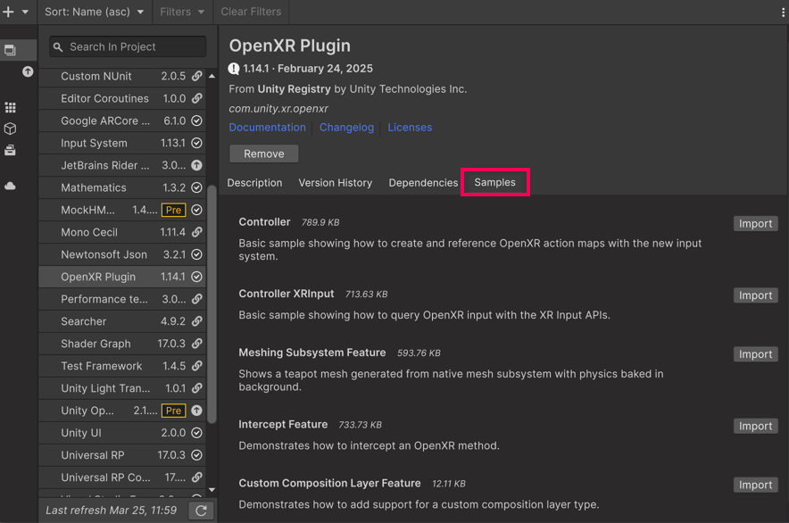

# OpenXR samples

Understand how to import OpenXR samples.

The OpenXR package provides samples that you can use to understand how to use the OpenXR plugin in more detail.

## Import OpenXR samples

You can access, learn about, and import the OpenXR samples from the [Package Manager](xref:um-upm-ui) as follows:

1. In the **Package Manager** window, open the **OpenXR Plugin** from the **In Project** tab.
1. Navigate to the **Samples** tab.
1. For each of the samples you want to use, press the corresponding **Import** button.
1. You can access your imported samples from `Assets/Samples/OpenXR Plugin/`<code class="long_version">X.Y.Z</code>.

You can learn more about each sample in the **Package Manager** or by opening the sample's `README` from the sample folder.

 *Access samples from the OpenXR Samples tab in the Package Manager.*
